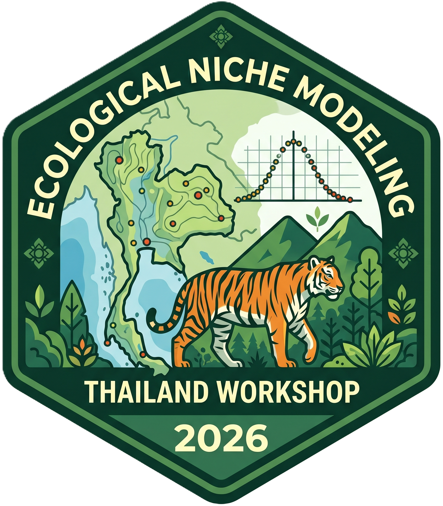

  

<h1 align="center">ENM-Thailand workshop 2026</h1>

  
  

A three-day hands-on workshop on **ecological niche modelling (ENM)** and **species distribution modelling (SDM)** in R, using Sambar deer (*Rusa unicolor*) in Thailand as the case study. The workshop walks participants through three modern R packages developed for the field, building each day on the outputs of the previous one.

The full rendered website lives at **<https://paanwaris.github.io/ENM-Thailand/>**.

---

## Workshop overview

| Day | Package | Focus |
|-----|---------|-------|
| 1 | [**nicheR**](https://github.com/castanedaM/nicheR) | Build an ellipsoid-based **virtual species** in environmental space, project it to Thailand, explore E-space in 3D (BIO1 × BIO12 × BIO15), and sample virtual occurrences under three strategies (`centroid`, `random`, `edge`). |
| 2a | — | Download and prepare the shared workshop inputs: Thailand boundary from GADM, WorldClim v2.1 bioclim layers, and GBIF occurrence records for *Rusa unicolor*, strictly filtered to field-observation `basisOfRecord`. |
| 2b | [**bean**](https://github.com/paanwaris/bean) | Reduce **environmental sampling bias** in real Sambar occurrence data by thinning points that cluster in E-space, fit an ellipsoid niche, and project suitability back to G-space. |
| 3 | [**TemporalModelR**](https://github.com/CJHughes926/TemporalModelR) | Build a **temporally explicit SDM** by pairing each occurrence with the environment it experienced at the time of observation. Uses local annual LST and precipitation rasters (2010–2025) provided in `temporal_rasters/`. |

Each day is delivered as a self-contained R Markdown notebook at the top of the repository.

---

## Authors

| | Role | ORCID |
|---|---|---|
| **Paanwaris Paansri** | Main author / Maintainer · `paanwaris@vt.edu` | <https://orcid.org/0000-0001-9992-098X> |
| **Luis E. Escobar** | Co-author · `escobar1@vt.edu`| <https://orcid.org/0000-0001-5735-2750> |

---

## Data sources & citations

- **GBIF**: GBIF.org occurrence download for *Rusa unicolor* via the `rgbif` package. Please cite the DOI returned by your own download.
- **WorldClim v2.1**: Fick, S.E. and R.J. Hijmans, 2017. WorldClim 2: new 1-km spatial resolution climate surfaces for global land areas. *International Journal of Climatology* 37 (12): 4302–4315. <https://www.worldclim.org/>
- **Thailand boundary**: GADM v4.1 (free for academic and non-commercial use).
- **Workshop packages**:
  - `nicheR`
  - `bean`
  - `TemporalModelR`

---

## License

MIT — see [`LICENSE.md`](LICENSE.md). Each underlying R package retains its own license.
