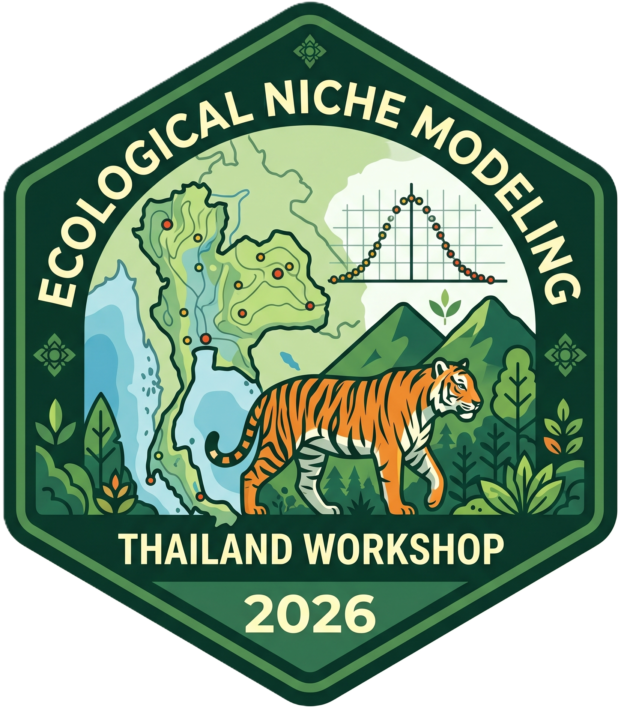
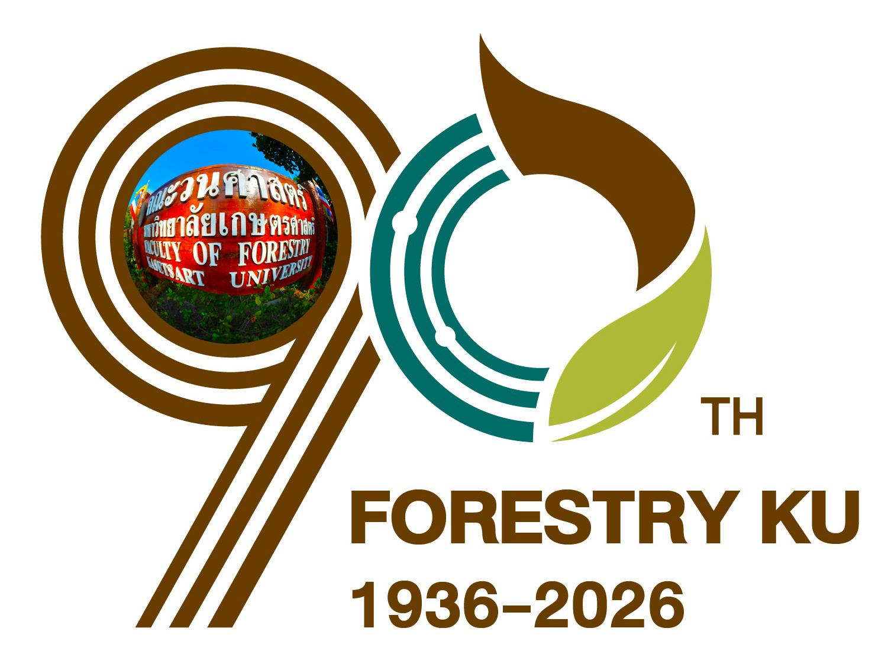

<p align="center">



</p>

<p align="center">

Organized by:  

Supported by:    

</p>

<h1 align="center">

ENM-Thailand workshop 2026

</h1>

<p align="center">

<a href="https://paanwaris.github.io/ENM-Thailand/">  </a> <a href="https://github.com/paanwaris/ENM-Thailand/blob/main/LICENSE.md">  </a>

</p>

A hands-on workshop on **ecological niche modeling (ENM)** in R, using Sambar deer (*Rusa unicolor*) data as a case study. The workshop walks participants through three modern R packages that cover the fundamental theory and an applied predictive workflow. The material is organized as four self-contained **Steps**, so instructors can pace the workshop flexibly — from a single intensive day to a longer multi-session course.

The full content is available at <https://paanwaris.github.io/ENM-Thailand/>.

------------------------------------------------------------------------

## Workshop overview

The workshop is delivered as four articles on the pkgdown site (Pre-workshop, nicheR, bean, and TemporalModelR). Each article is also a standalone R Markdown notebook in the repository.

| Step | Read on the site | Source notebook | Package(s) | Description |
|----|----|----|----|----|
| **Pre-workshop** | [Downloading the workshop data](https://paanwaris.github.io/ENM-Thailand/articles/Pre-workshop.html) | [`Pre-workshop.Rmd`](Pre-workshop.Rmd) | [**geodata**](https://github.com/rspatial/geodata) · [**rgbif**](https://github.com/ropensci/rgbif) | **Pre-workshop prep.** Download and prepare the shared inputs: Thailand boundary from GADM, WorldClim v2.1 bioclim layers, and GBIF occurrence records for *Rusa unicolor*, strictly filtered to field-observation `basisOfRecord`. |
| **Step 1** | [Virtual species with nicheR](https://paanwaris.github.io/ENM-Thailand/articles/Step1_nicheR.html) | [`Step1_nicheR.Rmd`](Step1_nicheR.Rmd) | [**nicheR**](https://github.com/castanedaM/nicheR) | Build an ellipsoid-based **virtual species** in environmental space, project it to Thailand, explore E-space in 3D (BIO1 × BIO12 × BIO15), and sample virtual occurrences under three strategies (`centroid`, `random`, `edge`). |
| **Step 2** | [Environmental thinning with bean](https://paanwaris.github.io/ENM-Thailand/articles/Step2_bean.html) | [`Step2_bean.Rmd`](Step2_bean.Rmd) | [**bean**](https://github.com/paanwaris/bean) | Reduce **environmental sampling bias** in real Sambar occurrence data by thinning points that cluster in E-space, fit an ellipsoid niche, and project suitability back to G-space. |
| **Step 3** | [Temporally-explicit SDMs with TemporalModelR](https://paanwaris.github.io/ENM-Thailand/articles/Step3_TemporalModelR.html) | [`Step3_TemporalModelR.Rmd`](Step3_TemporalModelR.Rmd) | [**TemporalModelR**](https://github.com/CJHughes926/TemporalModelR) | Build a **temporally explicit SDM** by pairing each occurrence with the environment it experienced at the time of observation. Uses local annual LST, precipitation, and NDVI rasters (2010–2025) provided in `temporal_rasters/`. |

> **Note:** All four notebooks sit at the top of this repository and can be opened in RStudio and rendered directly with the **Knit** button. Once the Pre-workshop step is complete, **Step 1**, **Step 2**, and **Step 3** are independent and can be run in any order during the workshop.

------------------------------------------------------------------------

## Before the workshop

This workshop assumes some familiarity with R, but **no prior programming experience is required to get set up**. Please complete the steps below *before the first session*.

### 1. Install R (the programming language)

Visit <https://cran.r-project.org/> and download the installer that matches your operating system (Windows / macOS / Linux). Run the installer with all default settings.

### 2. Install RStudio Desktop (the editor we will use)

Visit <https://posit.co/download/rstudio-desktop/> and download the free **RStudio Desktop** installer. Run it with default settings.

> Think of **R** as the engine and **RStudio** as the dashboard — RStudio is the window you will actually interact with during the workshop.

### 3. Download the workshop materials

Choose whichever option you are most comfortable with:

- **Easiest — Download a ZIP.** Visit <https://github.com/paanwaris/ENM-Thailand>, click the green **Code** button, choose **Download ZIP**, then unzip the folder somewhere memorable (for example, your Desktop).

- **For Git users — Clone the repository.** From a terminal, run:

  ``` bash
  git clone https://github.com/paanwaris/ENM-Thailand.git
  ```

### 4. Open the project in RStudio

Inside the unzipped folder, double-click **`ENM-Thailand.Rproj`**. This opens the project in RStudio with all file paths correctly set, so every notebook will run from the same working directory.

### 5. Prepare the workshop data

Open **`Pre-workshop.Rmd`** in RStudio, then choose **one** of these two approaches:

- **Recommended — Use the Zenodo shortcut (\~5 minutes).** Run only the chunk labeled *"Zenodo shortcut"* inside the notebook. It downloads a pre-built archive of every processed input we will use during the workshop.
- **Build the data yourself (\~15 minutes).** Click the **Knit** button at the top of the notebook. This downloads Thailand boundaries from GADM, WorldClim climate layers, and Sambar deer records from GBIF. You will need a free GBIF account (sign up at <https://www.gbif.org>) to complete this section.

### 6. Verify everything is in place

Then, the `data/processed/` folder should contain four sub-folders: **`bioclim/`**, **`boundary/`**, **`gbif/`**, and **`bias/`**. If you can see all four, you are ready for the workshop!

------------------------------------------------------------------------

## Resources

A short guide to the tools and data sources you will encounter during the workshop. Each link below is safe to click before the workshop if you would like a preview.

### Software you need to install

- [**R**](https://cran.r-project.org/) — the open-source programming language that powers every script in the workshop. You only need it installed; you will rarely interact with it directly.
- [**RStudio Desktop**](https://posit.co/download/rstudio-desktop/) — the editor we will use to open, edit, and run the workshop notebooks. The **Knit** button you will click lives here.
- **R Markdown** *(comes bundled with RStudio)* — the document format used by every `.Rmd` notebook. It mixes written explanations, R code, and figures in a single file you can run end-to-end.

### Workshop R packages

These packages are installed automatically the first time you knit each notebook, so you do not need to install them by hand.

- [**nicheR**](https://github.com/castanedaM/nicheR) *(Step 1)* — builds and visualizes **ellipsoid-shaped ecological niches** in environmental space, projects them to geographic space, and lets us simulate a virtual species so we can compare model outputs against a known truth.
  - Castaneda-Guzman M, Hughes C, Paansri P, Cobos M (2026). *nicheR: Ellipsoid-Based Virtual Niches and Visualization*. R package version 0.1.0, <https://github.com/castanedaM/nicheR>.
- [**bean**](https://github.com/paanwaris/bean) *(Step 2)* — reduces **environmental sampling bias** by thinning occurrence points in environmental space, and fits ellipsoid niches on the thinned points.
  - Paansri P, Escobar L (2026). *bean: Data Thinning of Species Occurrences in Environmental Space*. R package version 0.2.1, <https://github.com/paanwaris/bean>.
- [**TemporalModelR**](https://github.com/CJHughes926/TemporalModelR) *(Step 3)* — builds **temporally-explicit** species distribution models by pairing each occurrence with the environment it actually experienced at the time of observation, then projects suitability across years.
  - Hughes C, Castaneda-Guzman M, E. Escobar L (2026). *TemporalModelR: Temporally Explicit Species Distribution Modelling in R*. R package version 0.2.0, <https://github.com/CJHughes926/TemporalModelR>.
- [**geodata**](https://github.com/rspatial/geodata) *(Pre-workshop)* — downloads ready-to-use spatial datasets (country boundaries, climate layers, etc.) directly from inside R.
  - Hijmans R (2026). *geodata: Access Geographic Data*. R package version 0.6-10, <https://rspatial.github.io/geodata/>.
- [**rgbif**](https://github.com/ropensci/rgbif) *(Pre-workshop)* — programmatic access to the GBIF species occurrence database from inside R.
  - Chamberlain S, Barve V, Mcglinn D, Oldoni D, Desmet P, Geffert L, Ram K (2026). *rgbif: Interface to the Global Biodiversity Information Facility API*. R package version 3.8.5.2, <https://CRAN.R-project.org/package=rgbif>.

## Data sources

- [**Occurrence data**](https://www.gbif.org/) — the world's largest open repository of species occurrence records. We download Sambar deer records from here in the Pre-workshop step.
  - GBIF.org (10 June 2026), GBIF Occurrence Download for *Rusa unicolor* via the `rgbif` package: <https://doi.org/10.15468/dl.c4ts6s>
- [**Climate data**](https://www.worldclim.org/) — global gridded climate data at 1 km resolution. Provides the 19 "bioclim" variables we use as environmental predictors.
  - Fick, S.E. and R.J. Hijmans (2017). WorldClim 2: new 1-km spatial resolution climate surfaces for global land areas. *International Journal of Climatology*, 37 (12): 4302–4315. <https://www.worldclim.org/>
- [**Thailand boundary**](https://gadm.org/) — free administrative boundaries for every country and province. We use it for the Thailand boundary.
- [**Zenodo archive (DOI 10.5281/zenodo.20344510)**](https://zenodo.org/records/20344510) — a citable copy of the pre-processed inputs used in this workshop, with a permanent DOI. Faster to download than rebuilding the data from scratch.

## Authors

|   | Role | ORCID |
|----|----|----|
| **Paanwaris Paansri** | Main author / Maintainer · `paanwaris@vt.edu` | <https://orcid.org/0000-0001-9992-098X> |
| **Luis E. Escobar** | Co-author · `escobar1@vt.edu` | <https://orcid.org/0000-0001-5735-2750> |

------------------------------------------------------------------------

## License

MIT — see [`LICENSE.md`](LICENSE.md). Each underlying R package retains its own license.
