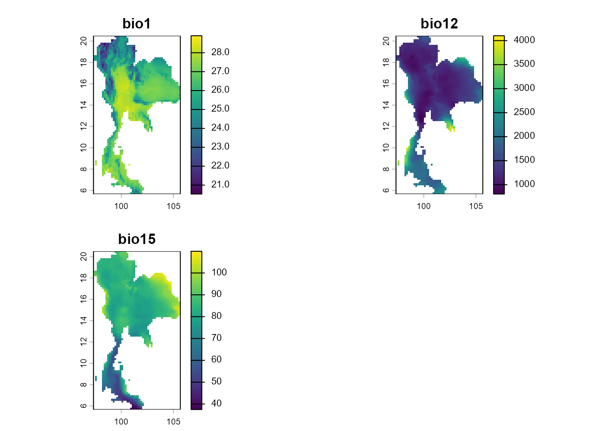
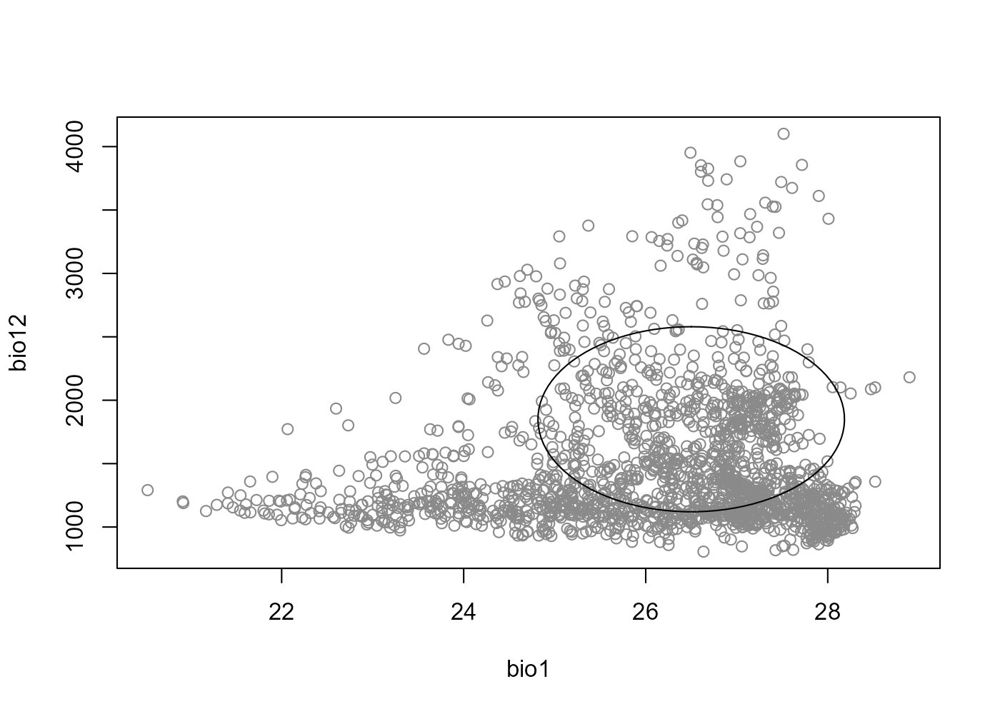
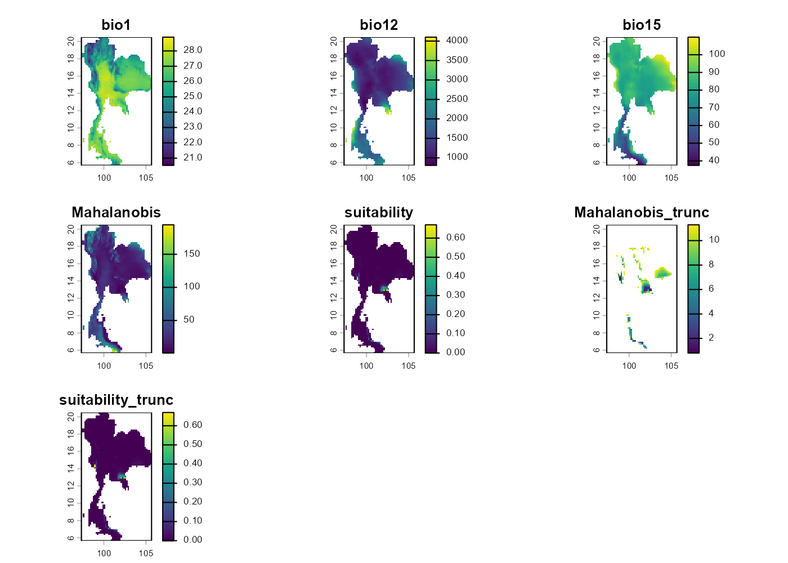
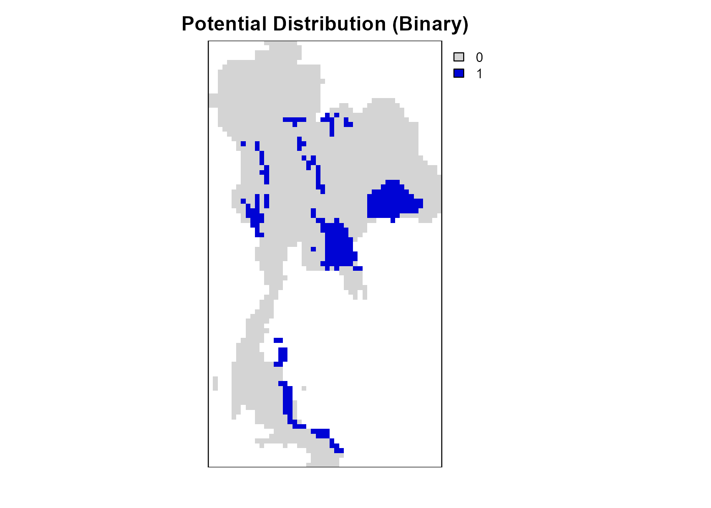
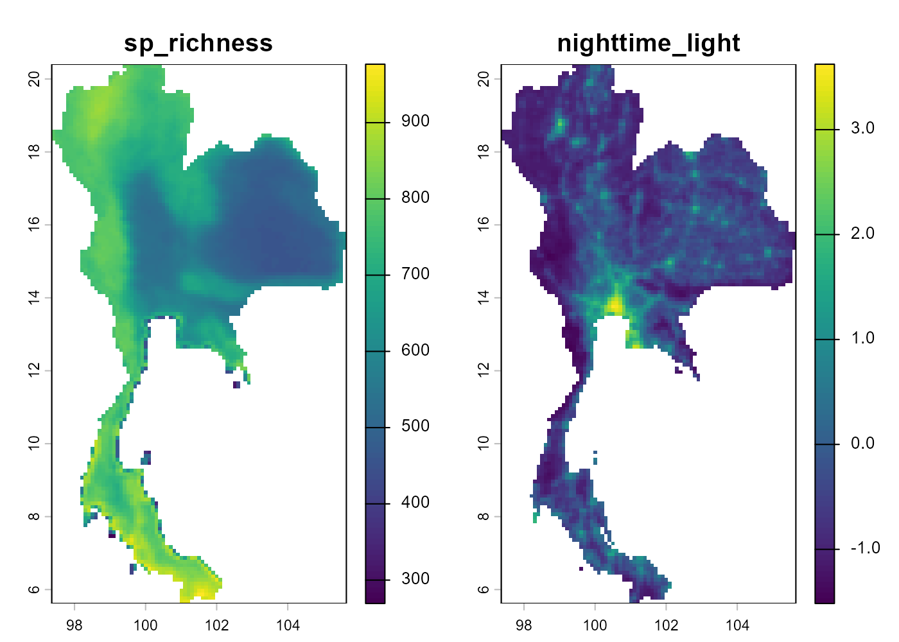
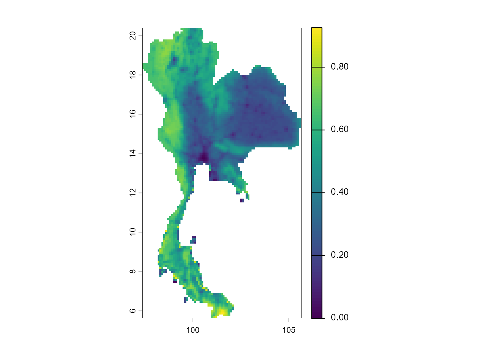
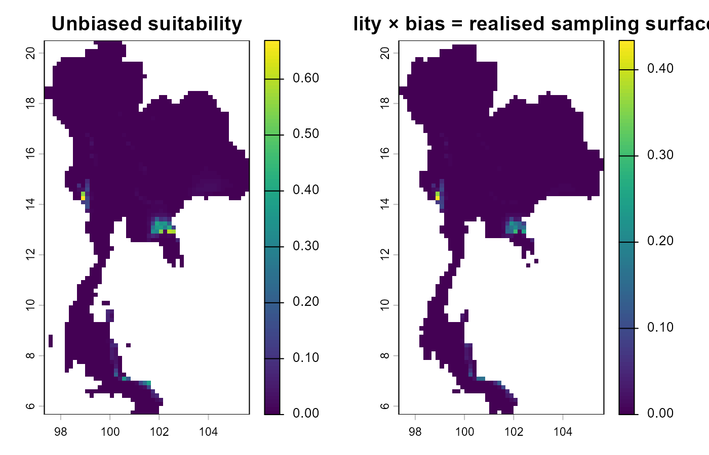
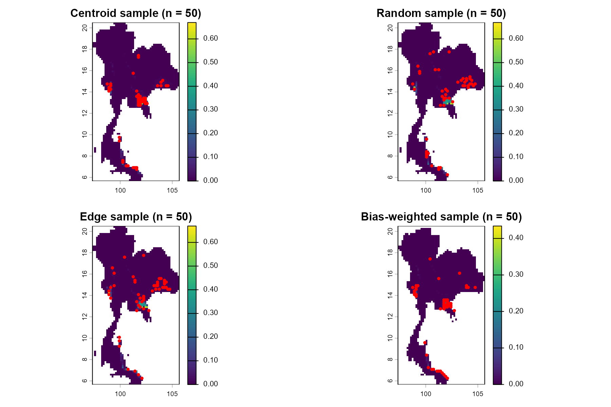
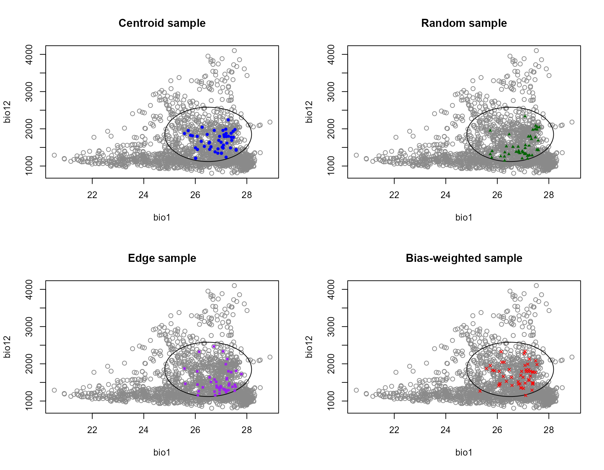

# Step 1 — Virtual species with nicheR

## Overview

> **Workshop navigation**
>
> - [Pre-workshop — Downloading the workshop
>   data.](https://paanwaris.github.io/ENM-Thailand/articles/Pre-workshop.html)
>   Get the Thailand boundary, WorldClim climate layers, and GBIF Sambar
>   records before the workshop starts.
> - **Step 1: nicheR — Virtual species with nicheR.** Build a virtual
>   species niche and map it.
> - [**Step 2: bean** — Environmental thinning with
>   bean.](https://paanwaris.github.io/ENM-Thailand/articles/Step2_bean.html)
>   Reduce environmental sampling bias before fitting a real niche.
> - [**Step 3: TemporalModelR** — Temporally-explicit models with
>   TemporalModelR.](https://paanwaris.github.io/ENM-Thailand/articles/Step3_TemporalModelR.html)
>   Link species occurrences with environmental data through time.

`nicheR` is an R package for building **virtual species’ ecological
niches** in environmental space (E-space) and projecting them onto
geographic space (G-space). An ellipsoid is the simplest closed shape
that can summarise a multivariate niche: it has a *centroid* (the
preferred conditions), *axes* (the directions of tolerance), and a
*volume* (the breadth of the niche).

In this Step we build the niche of a **virtual species** — a
hypothetical organism whose tolerances we choose ourselves. Working with
a virtual species is the ideal way to learn ENM mechanics because the
“true” niche is known by construction, so we can see exactly how each
property of the niche manifests on the map:

- **Niche position** (where the centroid sits in E-space) controls
  *where* on the map the species can occur.
- **Niche breadth** (how wide the axes are) controls *how widely* it can
  occur.
- **Niche shape** (the orientation and correlation between axes)
  controls *which combinations* of conditions matter.
- **Environmental availability** (the cloud of conditions Thailand
  actually offers) decides whether a niche can be expressed at all — a
  perfectly defined niche over conditions that do not exist in Thailand
  will simply produce an empty map.

In this Step we will:

1.  Explore the environmental space of Thailand in **three dimensions**
    using BIO1, BIO12, and BIO15.
2.  Build an ellipsoid from a user-defined range of bioclimatic
    tolerances.
3.  Project the ellipsoid to Thailand to obtain *suitability* and
    *Mahalanobis distance* maps.
4.  Add a sampling-bias layer that mimics uneven survey effort.
5.  Generate virtual occurrence points under three sampling strategies
    (`centroid`, `random`, `edge`) plus a bias-weighted draw.

All function names and arguments below follow the official package
documentation: <https://castanedam.github.io/nicheR/>

## Install and load packages

The chunk below installs everything Step 1 needs the first time you run
it. Re-running is safe — already-installed packages are skipped.

``` r

# ---- CRAN dependencies -----------------------------------------------------
cran_pkgs <- c(
  "terra",
  "sf",
  "plotly",
  "viridis",
  "rmarkdown",
  "knitr",
  "remotes"
)
to_install <- cran_pkgs[!cran_pkgs %in% rownames(installed.packages())]
if (length(to_install)) install.packages(to_install, dependencies = TRUE)

# ---- nicheR from GitHub ----------------------------------------------------
if (!requireNamespace("nicheR", quietly = TRUE)) {
  remotes::install_github("castanedaM/nicheR", upgrade = "never")
}
```

``` r

library(nicheR)   # build / project / sample ellipsoid niches
library(terra)    # modern raster + vector spatial backend
library(sf)       # tidy vector spatial data ("simple features")
library(plotly)   # interactive 3-D plots for the environmental space

# Make every random draw in the rest of the file reproducible.
set.seed(2026)
```

## Data

For Step 1 we work with the bioclim rasters and the Thailand polygon
that we produced in the Pre-workshop. **Please knit `Pre-workshop.Rmd`
first** so these files exist under `data/processed/`.

The two file extensions you will see in this folder are:

- **`.tif` (GeoTIFF)** — a raster format storing pixel grids of
  continuous values (e.g. temperature, precipitation). Our
  `bioclim_thailand.tif` is a single multi-band GeoTIFF that bundles all
  19 bioclim layers together.
- **`.gpkg` (GeoPackage)** — a modern, single-file format for vector
  data (points, lines, polygons). Our `thailand_boundary.gpkg` carries
  the country polygon and its attribute table.

``` r

bio_path <- "data/processed/bioclim/bioclim_thailand.tif"
tha_path <- "data/processed/boundary/thailand_boundary.gpkg"

# rast()    reads a multi-band GeoTIFF as a SpatRaster (one object, many layers).
# st_read() reads a vector file as an sf object (a data frame whose last
#           column is a geometry column).
bioclim  <- rast(bio_path)
thailand <- st_read(tha_path, quiet = TRUE)

# Draw just the country outline — st_geometry() strips the attribute table
# so we get the polygon without any colour fill.
plot(st_geometry(thailand))
```


``` r

# 19 layer names: bio1, bio2, ..., bio19.
names(bioclim)
```

    ##  [1] "bio1"  "bio2"  "bio3"  "bio4"  "bio5"  "bio6"  "bio7"  "bio8"  "bio9" 
    ## [10] "bio10" "bio11" "bio12" "bio13" "bio14" "bio15" "bio16" "bio17" "bio18"
    ## [19] "bio19"

``` r

# Per-layer statistics. Each column is one bioclim layer; each row is a
# summary statistic:
#   Min / Max   — full range of pixel values in raw units (°C for bio1,
#                 mm for bio12, etc.)
#   1st Qu / Median / 3rd Qu — the 25th, 50th, and 75th percentiles, i.e.
#                 how the values are distributed across pixels
#   Mean        — arithmetic average across all pixels
#   NA's        — number of pixels masked out (outside Thailand)
summary(bioclim)
```

    ##       bio1            bio2             bio3            bio4       
    ##  Min.   :20.53   Min.   : 6.737   Min.   :45.89   Min.   : 45.57  
    ##  1st Qu.:25.23   1st Qu.: 9.157   1st Qu.:53.61   1st Qu.:127.17  
    ##  Median :26.55   Median :10.508   Median :56.56   Median :198.82  
    ##  Mean   :26.15   Mean   :10.129   Mean   :58.98   Mean   :184.96  
    ##  3rd Qu.:27.24   3rd Qu.:11.088   3rd Qu.:62.05   3rd Qu.:239.76  
    ##  Max.   :28.90   Max.   :12.370   Max.   :82.32   Max.   :338.24  
    ##  NA's   :2634    NA's   :2634     NA's   :2634    NA's   :2634    
    ##       bio5            bio6             bio7            bio8      
    ##  Min.   :29.04   Min.   : 8.599   Min.   : 9.30   Min.   :21.76  
    ##  1st Qu.:33.29   1st Qu.:14.324   1st Qu.:14.07   1st Qu.:25.83  
    ##  Median :34.55   Median :16.836   Median :18.94   Median :26.87  
    ##  Mean   :34.46   Mean   :16.821   Mean   :17.64   Mean   :26.59  
    ##  3rd Qu.:35.72   3rd Qu.:19.446   3rd Qu.:20.35   3rd Qu.:27.64  
    ##  Max.   :38.14   Max.   :24.400   Max.   :23.56   Max.   :28.82  
    ##  NA's   :2634    NA's   :2634     NA's   :2634    NA's   :2634   
    ##       bio9           bio10           bio11           bio12          bio13      
    ##  Min.   :16.69   Min.   :23.13   Min.   :16.69   Min.   : 806   Min.   :170.0  
    ##  1st Qu.:22.16   1st Qu.:27.44   1st Qu.:22.04   1st Qu.:1121   1st Qu.:218.0  
    ##  Median :24.37   Median :28.38   Median :23.94   Median :1289   Median :248.0  
    ##  Mean   :23.94   Mean   :28.16   Mean   :23.60   Mean   :1491   Mean   :289.1  
    ##  3rd Qu.:25.90   3rd Qu.:29.19   3rd Qu.:25.47   3rd Qu.:1754   3rd Qu.:323.2  
    ##  Max.   :29.09   Max.   :30.56   Max.   :28.24   Max.   :4101   Max.   :876.0  
    ##  NA's   :2634    NA's   :2634    NA's   :2634    NA's   :2634   NA's   :2634   
    ##      bio14            bio15            bio16            bio17       
    ##  Min.   : 0.000   Min.   : 37.47   Min.   : 426.0   Min.   :  8.00  
    ##  1st Qu.: 3.000   1st Qu.: 78.22   1st Qu.: 555.0   1st Qu.: 19.00  
    ##  Median : 4.000   Median : 83.06   Median : 647.0   Median : 23.00  
    ##  Mean   : 9.628   Mean   : 81.19   Mean   : 748.3   Mean   : 47.74  
    ##  3rd Qu.: 6.000   3rd Qu.: 86.59   3rd Qu.: 840.0   3rd Qu.: 36.00  
    ##  Max.   :90.000   Max.   :109.94   Max.   :2530.0   Max.   :372.00  
    ##  NA's   :2634     NA's   :2634     NA's   :2634     NA's   :2634    
    ##      bio18            bio19        
    ##  Min.   : 157.0   Min.   :  13.00  
    ##  1st Qu.: 281.0   1st Qu.:  26.00  
    ##  Median : 344.0   Median :  42.00  
    ##  Mean   : 375.0   Mean   : 137.50  
    ##  3rd Qu.: 408.2   3rd Qu.:  69.25  
    ##  Max.   :1896.0   Max.   :1164.00  
    ##  NA's   :2634     NA's   :2634

For this exercise we will use only three of the 19 bioclim variables
that will draw the 3-D environmental space:

- **bio1** — annual mean temperature (°C)
- **bio12** — annual precipitation (mm)
- **bio15** — precipitation seasonality (coefficient of variation, CV)

``` r

# Subset the 19-layer raster down to the three variables we care about.
# `env_space` is a SpatRaster (used for spatial projection later on);
# `env_space_df` is a plain data frame of the *valid* pixel values
# (na.rm = TRUE drops pixels masked outside Thailand) — handy as the
# background cloud in 2-D and 3-D scatterplots.
env_space    <- bioclim[[c("bio1", "bio12", "bio15")]]
env_space_df <- as.data.frame(env_space, na.rm = TRUE)

plot(env_space)
```



## Explore Thailand’s environmental space in 3D

Before defining a niche, we will visualize the *available* environmental
conditions of Thailand in three dimensions: `BIO15` (precipitation
seasonality, CV) captures within-year rainfall variability and adds an
important third axis on top of mean temperature (`BIO1`) and total
annual precipitation (`BIO12`). Each grey dot in the 3-D cloud below is
one pixel of the country — together they outline the *envelope* of
conditions Thailand offers a species.

``` r

plotly::plot_ly(
  data   = env_space_df,
  x      = ~bio1, y = ~bio12, z = ~bio15,
  type   = "scatter3d", mode = "markers",
  marker = list(size = 2, opacity = 0.5)
) |>
  plotly::layout(scene = list(
    xaxis = list(title = "BIO1 (°C)"),
    yaxis = list(title = "BIO12 (mm)"),
    zaxis = list(title = "BIO15 (CV)")
  ))
```

## Define a virtual species’ ecological niche

A `nicheR` ellipsoid is built from a **range data frame** that lists the
lowest and highest value the species tolerates along each environmental
axis. From these ranges,
[`build_ellipsoid()`](https://castanedam.github.io/nicheR/reference/build_ellipsoid.html)
derives every other geometric property of the niche: the centroid (the
midpoint of the ranges), a covariance matrix (how axes co-vary), the
semi-axis lengths (the half-width of the ellipsoid in each direction),
and the niche volume.

For our virtual tropical mammal we set:

- **bio1 (mean annual T)** between **25 °C and 28 °C** — a warm, narrow
  thermal niche.
- **bio12 (annual precip.)** between **1200 mm and 2500 mm** — wet but
  not extreme.
- **bio15 (precip. seasonality, CV)** between **70 and 90** — moderately
  to strongly seasonal rainfall.

Together these three windows describe a small, well-defined ellipsoid
sitting in the lowland, seasonally-wet corner of Thailand’s
environmental space.

``` r

range_df <- data.frame(
  bio1  = c(25, 28),       # tolerated range of mean annual temperature  (°C)
  bio12 = c(1200, 2500),   # tolerated range of annual precipitation     (mm)
  bio15 = c(70, 90)        # tolerated range of precipitation seasonality (CV)
)

# build_ellipsoid() converts the range table into a full ellipsoid object:
# centroid, covariance matrix, semi-axes, volume.
ell <- build_ellipsoid(range = range_df)
ell
```

    ## nicheR Ellipsoid Object
    ## -----------------------
    ## Dimensions:        3D
    ## Chi-square cutoff: 11.345
    ## Centroid (mu):     26.5, 1850, 80
    ## 
    ## Covariance matrix:
    ##       bio1    bio12  bio15
    ## bio1  0.25     0.00  0.000
    ## bio12 0.00 46944.44  0.000
    ## bio15 0.00     0.00 11.111
    ## 
    ## Covariance Limits:
    ##                  min    max
    ## bio1-bio12   -54.167 107.25
    ## bio1-bio15    -0.833   1.65
    ## bio12-bio15 -361.111 715.00
    ## 
    ## Ellipsoid semi-axis lengths:
    ##   729.78, 11.227, 1.684
    ## 
    ## Ellipsoid axis endpoints:
    ##  Axis 1:
    ##          bio1   bio12 bio15
    ## vertex_a 26.5 1120.22    80
    ## vertex_b 26.5 2579.78    80
    ## 
    ##  Axis 2:
    ##          bio1 bio12  bio15
    ## vertex_a 26.5  1850 68.773
    ## vertex_b 26.5  1850 91.227
    ## 
    ##  Axis 3:
    ##            bio1 bio12 bio15
    ## vertex_a 24.816  1850    80
    ## vertex_b 28.184  1850    80
    ## 
    ## Ellipsoid volume:  57800.1

Printing `ell` shows a compact summary of the niche. Reading the output
line by line:

- **Dimensions: 3D.** Three environmental axes, so the ellipsoid is a
  true 3-D shape (an “egg” in BIO1 × BIO12 × BIO15 space).
- **Chi-square cutoff: 11.345.** The 95% probability boundary of the
  niche, taken from the chi-square distribution with 3 degrees of
  freedom. Pixels with a squared Mahalanobis distance below this cutoff
  fall *inside* the niche; the rest are *outside*.
- **Centroid (mu): (26.5, 1850, 80).** The geometric centre of the
  ranges — the *most preferred* environmental conditions.
- **Covariance matrix.** A diagonal matrix because the three ranges were
  specified independently — each axis varies on its own and the
  cross-axis covariances are zero.
- **Ellipsoid semi-axis lengths: 729.78, 11.227, 1.684.** The
  half-widths of the ellipsoid in each direction. Notice how stretched
  the bio12 axis is (precipitation values span hundreds of mm) compared
  with bio15 (CV values span tens) — the ellipsoid is *very* elongated
  along precipitation.
- **Ellipsoid axis endpoints.** The two vertex coordinates at the ends
  of each axis — useful for sanity-checking that the ellipsoid actually
  reaches the ranges you specified.
- **Ellipsoid volume: 57 800.1.** The total amount of E-space the niche
  occupies, in mixed units. Useful for comparing niche breadths between
  species.

We can visualise the ellipsoid in E-space against the cloud of
environmental conditions Thailand actually offers — the *background
point cloud*. Every grey dot is one pixel of the country plotted in BIO1
× BIO12 (the third axis, BIO15, is collapsed in this 2-D view). A niche
that sits inside the cloud can be realised geographically; a niche that
sits outside the cloud will produce an empty suitability map.

``` r

plot_ellipsoid(ell, background = env_space_df)
```



The ellipse in the plot is the 2-D projection of the niche onto the BIO1
× BIO12 plane. The grey dots are the background point cloud. Pixels that
fall *inside* the ellipse correspond to places on the map where the
virtual species can occur; pixels outside the ellipse are
environmentally unsuitable.

## Project the niche to geography (suitability + Mahalanobis distance)

[`predict()`](https://rspatial.github.io/terra/reference/predict.html)
projects the ellipsoid from E-space onto a `SpatRaster` of environmental
conditions (here, our Thailand `env_space` stack) and returns two
surfaces, layer by layer:

- **Suitability.** A 0–1 score that peaks at 1 at the centroid and falls
  off smoothly toward the boundary. When `suitability_truncated = TRUE`,
  pixels outside the niche are clamped to 0, giving a cleaner “in or
  out” answer in a layer called `suitability_trunc`.
- **Mahalanobis distance.** A multivariate distance from the centroid
  that takes the shape and correlations of the niche into account. Low =
  environmentally similar to the centre of the niche; high = far from
  it. A truncated version (`Mahal_trunc`) is also produced.

In short, *suitability* is the probability-like score you would plot on
a map, and *Mahalanobis distance* is the raw geometric distance used to
compute it.

``` r

pred <- predict(
  ell,                                # the ellipsoid we just built
  newdata               = env_space,  # SpatRaster to project onto
  include_suitability   = TRUE,       # return the suitability surface
  suitability_truncated = TRUE,       # also return a clamped (in/out) version
  include_mahalanobis   = TRUE,       # return the Mahalanobis-distance surface
  mahalanobis_truncated = TRUE,       # also return a clamped version
  keep_data             = TRUE        # keep the original env layers in `pred`
)

# pred is now a multi-layer SpatRaster carrying: the three predictors
# (bio1, bio12, bio15), the two suitability layers (full + truncated), and
# the two Mahalanobis layers (full + truncated).
pred
```

    ## class       : SpatRaster 
    ## size        : 89, 50, 7  (nrow, ncol, nlyr)
    ## resolution  : 0.1666667, 0.1666667  (x, y)
    ## extent      : 97.33333, 105.6667, 5.666667, 20.5  (xmin, xmax, ymin, ymax)
    ## coord. ref. : lon/lat WGS 84 (EPSG:4326) 
    ## sources     : bioclim_thailand.tif  (3 layers) 
    ##               memory  
    ##               memory  
    ##               ... and 2 more sources
    ## names       :     bio1, bio12,     bio15, Mahalanobis,  suitability, Mahal~trunc, ... 
    ## min values  : 20.52728,   806,  37.47298,   0.8032656, 5.926184e-43,   0.8032656, ... 
    ## max values  : 28.89861,  4101, 109.94184, 194.4635571, 6.692265e-01,  11.2917557, ...

The printout describes `pred` as a `SpatRaster` with 89 × 50 pixels and
7 layers. The `min values` / `max values` rows give the range of each
layer across all pixels.

``` r

plot(pred, col = viridis::viridis(100))
```



``` r

# A "binary potential distribution" is just the truncated suitability
# turned into 1 / 0: 1 wherever the niche is realised, 0 elsewhere.
binary_rast <- (pred$suitability_trunc > 0) * 1

plot(binary_rast,
     axes = FALSE,                              # hide longitude/latitude tick labels
     box  = TRUE,                               # keep the surrounding frame
     col  = c("#d4d4d4", "#0004d5"),            # grey = unsuitable, blue = suitable
     main = "Potential Distribution (Binary)")
```



## Add a sampling-bias layer

Real-world surveys are uneven: roads, cities, protected areas, and
research stations get visited far more often than remote interiors. We
can simulate this unevenness with a **bias surface** and combine it with
our suitability to obtain a *realised* sampling surface, what we would
actually expect to record if surveys happened in proportion to where
field effort is concentrated.

For this lesson we use the two proxy rasters we wrote in the
Pre-workshop:

- **Species richness** — the number of recorded species per pixel. Many
  recorded species in a pixel implies that many surveys have been done
  there. We treat richness as a **direct** proxy: higher richness → more
  sampling effort.
- **Night-time lights** — a satellite measure of artificial light. High
  light values mark cities and roads. Because remote Sambar deer habitat
  is *dark*, we treat night-time lights as an **inverse** proxy: more
  light → *less* relevant sampling effort for our forest-dwelling
  virtual species.

``` r

sp_rich_layer   <- rast("data/processed/bias/sp_richness_TH.tif")
nighttime_layer <- rast("data/processed/bias/nighttime_TH.tif")

# Stack the two proxies into a 2-layer SpatRaster and rename for clarity.
bias_layer <- c(sp_rich_layer, nighttime_layer)
names(bias_layer) <- c("sp_richness", "nighttime_light")
plot(bias_layer)
```



``` r

# prepare_bias() rescales each proxy to 0-1, optionally inverts proxies whose
# *high* values represent *low* sampling effort, and combines the two into a
# single composite surface. `effect_direction = c("direct", "inverse")`
# tells it to use richness directly but invert night-time lights.
bias_prep <- prepare_bias(
  bias_surface     = bias_layer,
  effect_direction = c("direct", "inverse")
)

# The composite surface is a 0-1 map of "how likely a survey would happen
# here": high values mark accessible, biodiversity-rich pixels; low values
# mark remote, brightly-lit-but-empty pixels (essentially, urban areas).
plot(bias_prep$composite_surface)
```



We then **multiply** the suitability by the bias surface to get a
realised sampling probability. Pixels that are both suitable for the
species *and* easy to survey light up; pixels that are biologically
suitable but in remote areas dim down.

``` r

biased_pred <- apply_bias(
  prepared_bias    = bias_prep,                 # the composite bias surface from prepare_bias()
  prediction       = pred,                      # the projected ellipsoid from predict()
  prediction_layer = "suitability",             # which layer of `pred` to multiply against bias
  effect_direction = "direct"                   # high bias → high realised sampling
)

par(mfrow = c(1, 2))
plot(pred$suitability,
     main = "Unbiased suitability")
plot(biased_pred$suitability_biased,
     main = "Suitability × bias = realised sampling surface")
```



``` r

par(mfrow = c(1, 1))
```

The biological niche is identical in both maps, but the
realised-sampling surface concentrates around accessible,
biodiversity-rich pixels of Thailand — only those parts of the niche
would realistically generate records in a biased field survey.

## Generate virtual occurrences under three sampling strategies

So far we have a *niche* but no occurrences. To compare ENM methods
later in **Step 2: bean** and **Step 3: TemporalModelR**, we draw
virtual records from the niche. Generating virtual occurrences is
essential to ENM teaching because — unlike with real species — we know
the underlying truth and can measure how well any method recovers it.

[`nicheR::sample_data()`](https://castanedam.github.io/nicheR/reference/sample_data.html)
lets us choose **where in the niche** the simulated points are drawn
from:

- `"centroid"` — points weighted toward the niche centroid (preferred
  conditions). Mimics surveys that find a species near the *heart* of
  its range.
- `"random"` — points drawn uniformly from inside the niche. The neutral
  reference.
- `"edge"` — points weighted toward the *periphery* of the niche
  (marginal conditions). Mimics surveys at the species’ range edges.

To ensure every simulated point falls **inside** the ellipsoid, we
sample from the *truncated* suitability layer (`suitability_trunc`),
which is 0 outside the niche by construction.

``` r

pts_centroid <- sample_data(
  n_occ            = 50,                  # number of points to draw
  prediction       = pred,                # SpatRaster we projected onto
  sampling         = "centroid",          # weight toward the centre of the niche
  prediction_layer = "suitability_trunc", # truncated → points fall *inside* the ellipsoid only
  seed             = 123                  # reproducible random draws
)

pts_random   <- sample_data(
  n_occ            = 50,
  prediction       = pred,
  sampling         = "random",            # uniform sampling inside the niche
  prediction_layer = "suitability_trunc",
  seed             = 123
)

pts_edge     <- sample_data(
  n_occ            = 50,
  prediction       = pred,
  sampling         = "edge",              # weight toward the periphery of the niche
  prediction_layer = "suitability_trunc",
  seed             = 123
)

# Each returned table carries the (x, y) coordinate of the simulated point
# and the environmental values extracted at that pixel.
head(pts_centroid)
```

    ##              x        y     bio1 bio12    bio15 Mahalanobis suitability
    ## 2229 102.08333 13.08333 25.89022  1813 77.81184   1.9474173  0.37767975
    ## 2127 101.75000 13.41667 27.08018  1483 76.20728   5.5101608  0.06360391
    ## 2179 102.08333 13.25000 26.23296  1663 76.44091   2.1701886  0.33786993
    ## 1788 103.58333 14.58333 26.87372  1345 84.16775   7.5544573  0.02288603
    ## 2027 101.75000 13.75000 27.58179  1443 77.30541   8.8631764  0.01189558
    ## 1860  98.91667 14.25000 26.46350  1848 82.97742   0.8032656  0.66922646
    ##      Mahalanobis_trunc suitability_trunc
    ## 2229         1.9474173        0.37767975
    ## 2127         5.5101608        0.06360391
    ## 2179         2.1701886        0.33786993
    ## 1788         7.5544573        0.02288603
    ## 2027         8.8631764        0.01189558
    ## 1860         0.8032656        0.66922646

``` r

head(pts_random)
```

    ##             x         y     bio1 bio12    bio15 Mahalanobis suitability
    ## 1643 104.4167 15.083333 26.96973  1401 87.07952    9.687811 0.007876231
    ## 2327 101.7500 12.750000 27.53995  1980 77.87899    5.090845 0.078439915
    ## 1745 104.7500 14.750000 26.81006  1519 88.56891    9.326756 0.009434538
    ## 3667 100.0833  8.250000 27.54879  2047 77.28593    5.889512 0.052614898
    ## 4020 100.5833  7.083333 27.20664  1792 80.18128    2.072000 0.354871304
    ## 869  100.4167 17.583333 26.29292  1368 87.25325    9.855314 0.007243455
    ##      Mahalanobis_trunc suitability_trunc
    ## 1643          9.687811       0.007876231
    ## 2327          5.090845       0.078439915
    ## 1745          9.326756       0.009434538
    ## 3667          5.889512       0.052614898
    ## 4020          2.072000       0.354871304
    ## 869           9.855314       0.007243455

``` r

head(pts_edge)
```

    ##             x         y     bio1 bio12    bio15 Mahalanobis suitability
    ## 1575 101.4167 15.250000 26.93975  1203 78.13216   10.004630 0.006722365
    ## 4279 102.0833  6.250000 27.07854  2336 80.36767    6.382389 0.041122715
    ## 2330 102.2500 12.750000 26.71942  2467 83.62048    9.481639 0.008731489
    ## 4177 101.7500  6.583333 27.24115  2129 76.57499    4.911150 0.085813854
    ## 4021 100.7500  7.083333 27.39359  1775 79.05531    3.394147 0.183218946
    ## 1795 104.7500 14.583333 26.75018  1578 90.15889   11.114619 0.003859145
    ##      Mahalanobis_trunc suitability_trunc
    ## 1575         10.004630       0.006722365
    ## 4279          6.382389       0.041122715
    ## 2330          9.481639       0.008731489
    ## 4177          4.911150       0.085813854
    ## 4021          3.394147       0.183218946
    ## 1795         11.114619       0.003859145

A **bias-weighted** draw uses
[`sample_biased_data()`](https://castanedam.github.io/nicheR/reference/sample_biased_data.html)
together with the realised sampling surface from above. The result
mimics what a *biased* field survey would record — samples cluster where
the species can occur **and** where surveys actually happen.

``` r

biased_pts <- sample_biased_data(
  n_occ            = 50,                            # number of points to draw
  prediction       = biased_pred,                   # SpatRaster from apply_bias()
  prediction_layer = "suitability_biased_direct",   # the layer apply_bias() produced
  seed             = 123
)

head(biased_pts)
```

    ##              x        y suitability_biased_direct
    ## 2179 102.08333 13.25000               0.169876848
    ## 4279 102.08333  6.25000               0.032600839
    ## 2277 101.75000 12.91667               0.147275526
    ## 2077 101.75000 13.58333               0.009762376
    ## 1690 103.91667 14.91667               0.003202499
    ## 1860  98.91667 14.25000               0.434026880

``` r

# Pull the BIO1 / BIO12 / BIO15 values at each biased point so we can
# overlay them in E-space alongside the other three samples below.
occ_bias_env <- terra::extract(env_space, biased_pts[, c("x", "y")])
```

### Geographic view — where each strategy puts the points

``` r

par(mfrow = c(2, 2))

plot(pred[["suitability"]],
     main = "Centroid sample (n = 50)")
points(pts_centroid[, c("x", "y")], pch = 19, cex = 0.6, col = "red")

plot(pred[["suitability"]],
     main = "Random sample (n = 50)")
points(pts_random[, c("x", "y")], pch = 19, cex = 0.6, col = "red")

plot(pred[["suitability"]],
     main = "Edge sample (n = 50)")
points(pts_edge[, c("x", "y")], pch = 19, cex = 0.6, col = "red")

plot(biased_pred$suitability_biased,
     main = "Bias-weighted sample (n = 50)")
points(biased_pts[, c("x", "y")], pch = 19, cex = 0.6, col = "red")
```



``` r

par(mfrow = c(1, 1))
```

Each panel shows the projected suitability surface in viridis (yellow =
high suitability, dark = low), with the simulated 50 occurrences in
**red**. Reading across the panels:

- The **centroid** sample clusters around the *core* of the niche on the
  map.
- The **random** sample is scattered evenly *inside* the suitable area.
- The **edge** sample drifts toward the *boundary* of the suitable area.
- The **bias-weighted** sample collapses onto the *accessible* part of
  the niche — the parts of the country where surveys would realistically
  happen.

### Environmental-space view — same points, different colours

This time we draw **one panel per strategy** so the contrast between
sampling rules is obvious. Each panel shows the same ellipsoid (the
niche) and the same grey background cloud (Thailand’s available
conditions), with the 50 simulated points of that strategy overlaid as
coloured markers.

``` r

par(mfrow = c(2, 2))

plot_ellipsoid(ell, background = env_space_df)
title(main = "Centroid sample")
points(pts_centroid[, c("bio1", "bio12")],
       col = "blue", pch = 19, cex = 0.6)

plot_ellipsoid(ell, background = env_space_df)
title(main = "Random sample")
points(pts_random[, c("bio1", "bio12")],
       col = "darkgreen", pch = 17, cex = 0.6)

plot_ellipsoid(ell, background = env_space_df)
title(main = "Edge sample")
points(pts_edge[, c("bio1", "bio12")],
       col = "purple", pch = 15, cex = 0.6)

plot_ellipsoid(ell, background = env_space_df)
title(main = "Bias-weighted sample")
points(occ_bias_env[, c("bio1", "bio12")],
       col = "red", pch = 4, cex = 0.6)
```



``` r

par(mfrow = c(1, 1))
```

Reading the panels: the ellipse is the 2-D projection of the niche; the
grey cloud is Thailand’s available environmental conditions; the
coloured markers are the 50 simulated records of each strategy. The
centroid points hug the centre of the ellipse, the random points scatter
evenly inside it, the edge points fringe the boundary, and the
bias-weighted points concentrate on the side of the niche that overlaps
the accessible, biodiversity-rich part of the country.

## Wrap-up

What we just did:

- Defined a niche *a priori* as a 3-D ellipsoid in BIO1 × BIO12 × BIO15
  space.
- Explored Thailand’s available environmental space in 3D.
- Projected the ellipsoid back to geography and inspected the
  suitability and Mahalanobis-distance surfaces.
- Built a sampling-bias surface from species richness and night-time
  lights and combined it with suitability to obtain a realised sampling
  surface.
- Compared three sampling strategies (`centroid`, `random`, `edge`) plus
  a bias-weighted draw, both geographically and in environmental space.

## References

- Castaneda-Guzman M, Hughes C, Paansri P, Cobos M (2026). *nicheR:
  Ellipsoid-Based Virtual Niches and Visualization*. R package version
  0.1.0, <https://github.com/castanedaM/nicheR>.
- Chamberlain S, Barve V, Mcglinn D, Oldoni D, Desmet P, Geffert L, Ram
  K (2026). *rgbif: Interface to the Global Biodiversity Information
  Facility API*. R package version 3.8.5.2,
  <https://CRAN.R-project.org/package=rgbif>.
- Hijmans R (2026). *geodata: Access Geographic Data*. R package version
  0.6-10, <https://rspatial.github.io/geodata/>.
- Hughes C, Castaneda-Guzman M, E. Escobar L (2026). *TemporalModelR:
  Temporally Explicit Species Distribution Modelling in R*. R package
  version 0.2.0, <https://github.com/CJHughes926/TemporalModelR>.
- Paansri P, Escobar L (2026). *bean: Data Thinning of Species
  Occurrences in Environmental Space*. R package version 0.2.1,
  <https://github.com/paanwaris/bean>.
