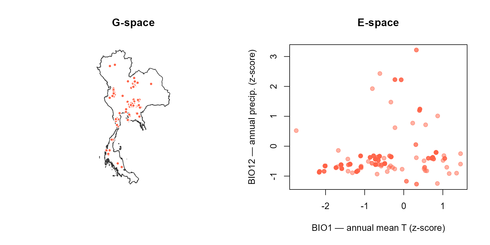
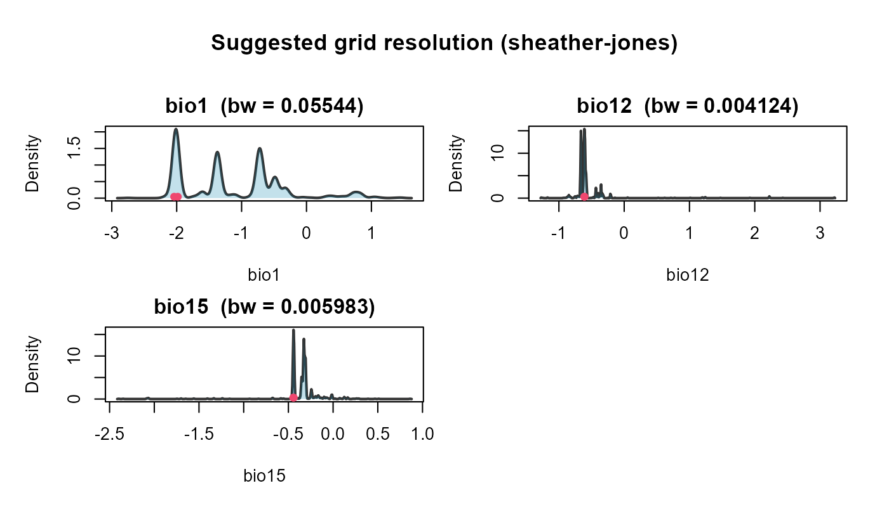
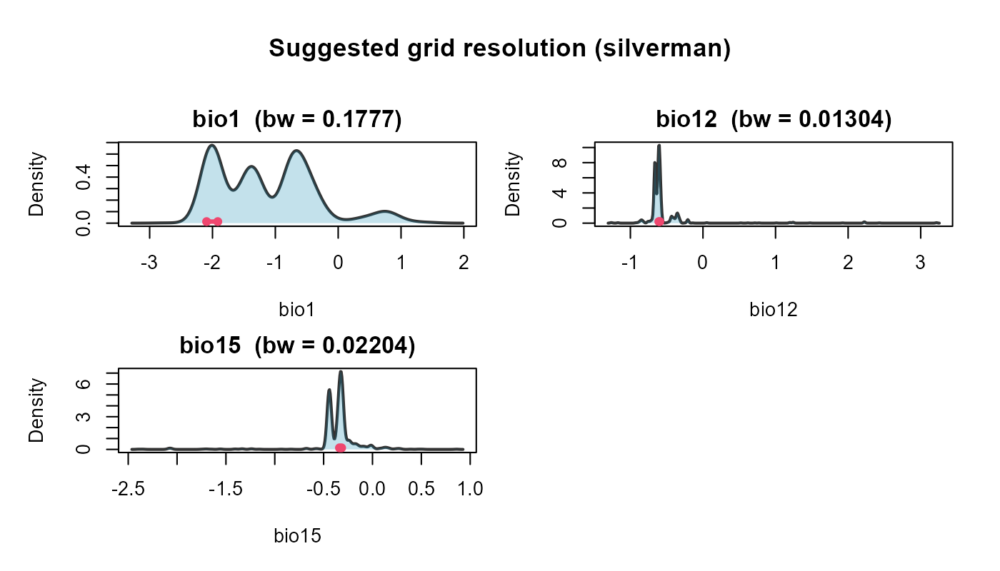
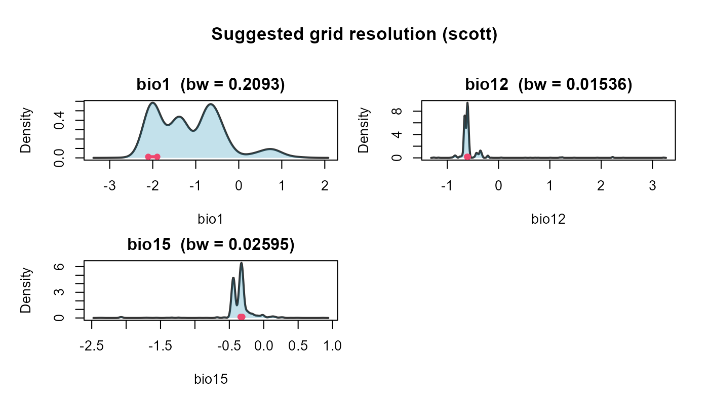
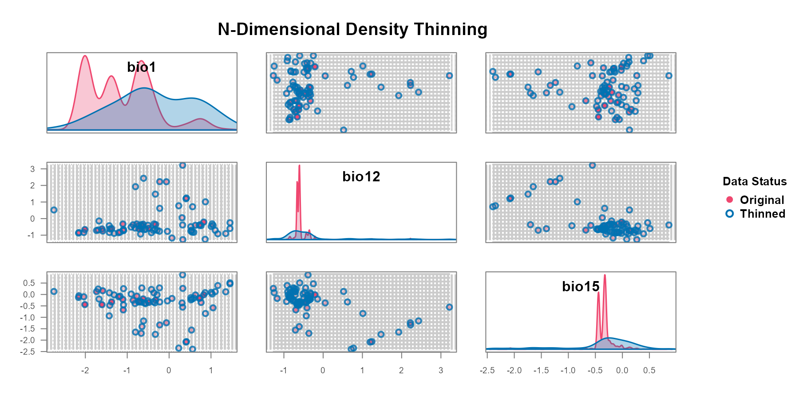
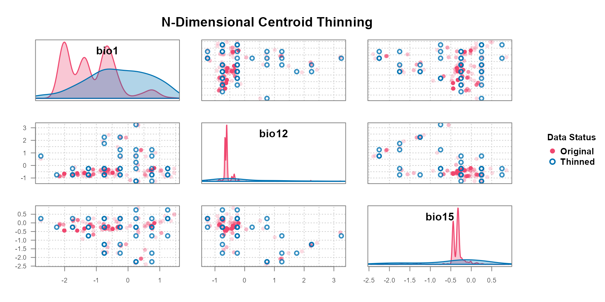
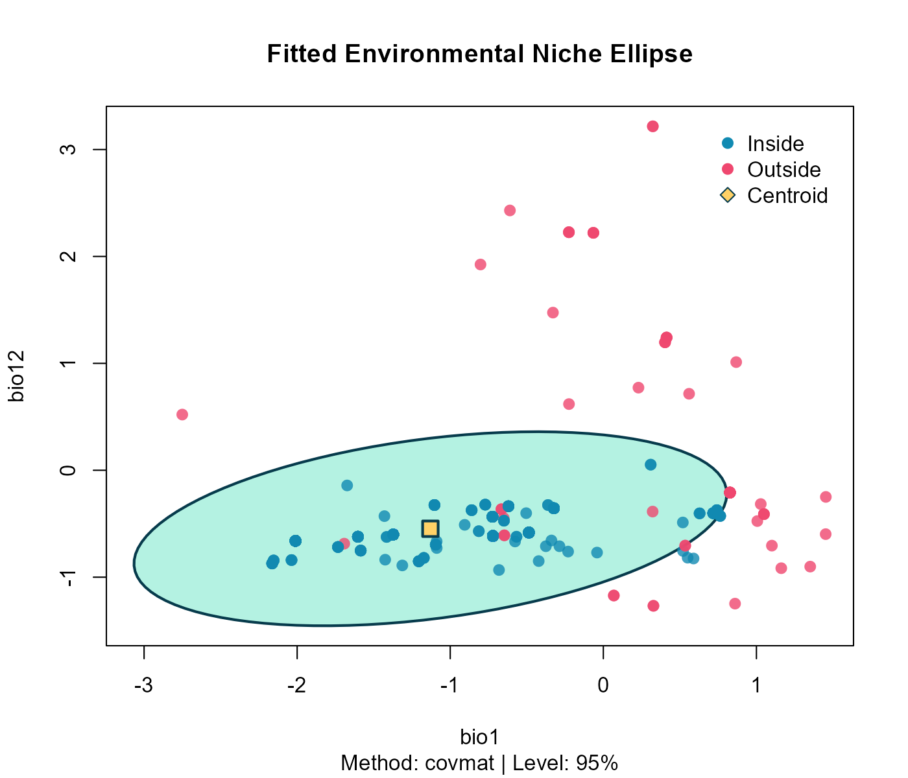
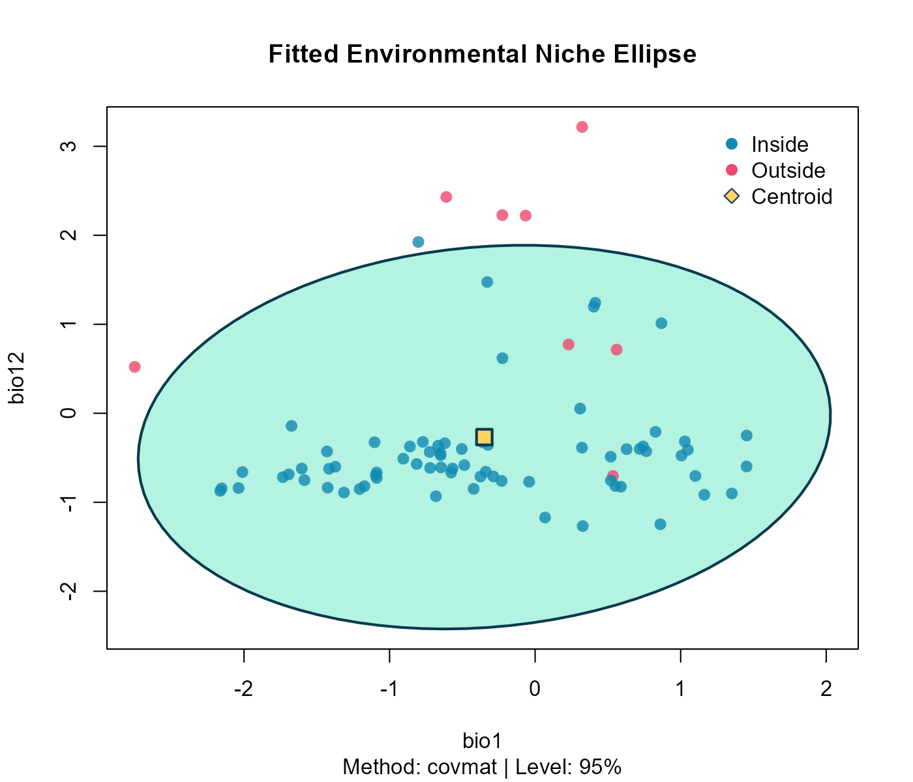
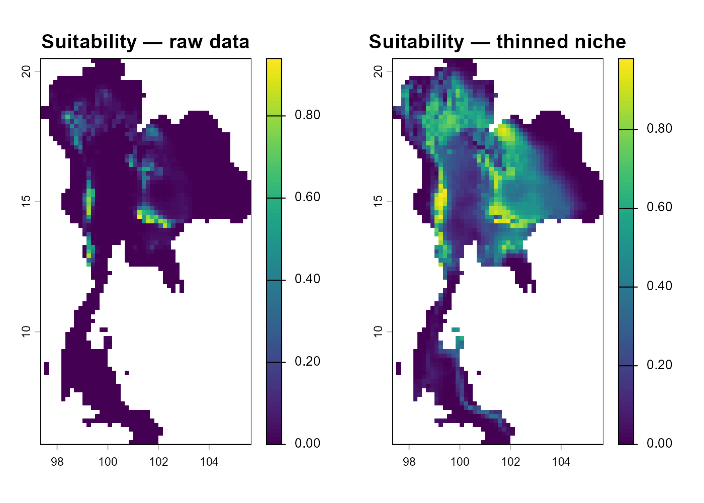

# Step 2 — Environmental thinning with bean

## Overview

> **Workshop navigation**
>
> - [**Pre-workshop** — Downloading the workshop
>   data.](https://paanwaris.github.io/ENM-Thailand/articles/Pre-workshop.html)
>   Get the Thailand boundary, WorldClim climate layers, and GBIF Sambar
>   records before the workshop starts.
> - [**Step 1: nicheR** — Virtual species with
>   nicheR.](https://paanwaris.github.io/ENM-Thailand/articles/Step1_nicheR.html)
>   Build a virtual species niche and map it.
> - **Step 2: bean — Environmental thinning with bean.** Reduce
>   environmental sampling bias before fitting a real niche.
> - [**Step 3: TemporalModelR** — Temporally-explicit models with
>   TemporalModelR.](https://paanwaris.github.io/ENM-Thailand/articles/Step3_TemporalModelR.html)
>   Link species occurrences with environmental data through time.

Some occurrence datasets are heavily **biased**: field collecting sample
in easily accessible places (roads, protected areas, research stations)
far more often than remote interiors, so the records cluster on the map.
The classical fix is to **thin in geographic space (G-space)**, keep at
most one point per spatial grid cell. That removes spatial duplication,
but it has a hidden cost: two records that sit close together on the map
can capture very different environmental conditions (one on a ridge, one
in a valley), and G-space thinning discards that information.

`bean` solves the problem differently. It thins **in environmental space
(E-space)**, keeping at most one point per cell of an environmental
grid. The intuition is that two occurrences with nearly identical
climate values are *environmentally redundant*, no matter how far apart
they are on the map. Thinning per environmental cell (one “pod”)
therefore produces a more even coverage of the species’ niche and a less
biased niche estimate.

In this Step we will:

1.  Load the cleaned GBIF occurrences for Sambar deer in Thailand
    (written by `Pre-workshop.Rmd`).
2.  Prepare the occurrences for `bean` and visualise the bias in
    E-space.
3.  Find an **objective** environmental grid resolution.
4.  Thin the points with both methods (`thin_env_nd` stochastic,
    `thin_env_center` deterministic).
5.  Fit an ellipsoid niche on the thinned points and map suitability
    back to G-space.

All function names and arguments below follow the official package
documentation: <https://paanwaris.github.io/bean/>

## Install and load packages

``` r

# ---- CRAN dependencies -----------------------------------------------------
cran_pkgs <- c(
  "terra",
  "sf",
  "dplyr",
  "readr",
  "rmarkdown",
  "knitr",
  "remotes",
  "rgl",
  "bean"
)
```

``` r

library(bean)     # environmental thinning in E-space
library(terra)    # modern raster + vector spatial backend
library(sf)       # tidy vector spatial data ("simple features")
library(dplyr)    # tidy data manipulation
library(readr)    # fast, friendly CSV reading and writing
library(rgl)      # interactive 3-D rendering for the ellipsoid plots

# rgl::setupKnitr() lets knitr embed any rgl/WebGL plot as a rotatable
# widget directly in the rendered HTML page.
rgl::setupKnitr(autoprint = TRUE)

# Make every random draw in the rest of the file reproducible.
set.seed(2026)
```

``` r

# Inputs prepared by the Pre-workshop notebook.
bioclim  <- rast("data/processed/bioclim/bioclim_thailand.tif")
thailand <- st_read("data/processed/boundary/thailand_boundary.gpkg",
                    quiet = TRUE)
sambar   <- read_csv("data/processed/gbif/sambar_thailand.csv",
                     show_col_types = FALSE)

head(sambar)
```

    ## # A tibble: 6 × 7
    ##   species      decimalLongitude decimalLatitude  year month basisOfRecord gbifID
    ##   <chr>                   <dbl>           <dbl> <dbl> <dbl> <chr>          <dbl>
    ## 1 Rusa unicol…             101.            14.4  2026     1 HUMAN_OBSERV… 6.13e9
    ## 2 Rusa unicol…             101.            14.4  2026     1 HUMAN_OBSERV… 6.13e9
    ## 3 Rusa unicol…             101.            14.5  2026     1 HUMAN_OBSERV… 6.13e9
    ## 4 Rusa unicol…             101.            14.4  2026     1 HUMAN_OBSERV… 6.13e9
    ## 5 Rusa unicol…             101.            14.5  2026     1 HUMAN_OBSERV… 6.13e9
    ## 6 Rusa unicol…             101.            14.5  2026     1 HUMAN_OBSERV… 6.13e9

For this exercise we use three bioclim variables, which map the Sambar
deer habitat (warm, wet, evergreen and mixed forests).

``` r

# Subset the 19-layer bioclim stack down to the three variables that will
# define the ellipsoid axes.
env <- bioclim[[c("bio1", "bio12", "bio15")]]
names(env) <- c("bio1", "bio12", "bio15")
```

## Prepare occurrences

[`prepare_bean()`](https://paanwaris.github.io/bean/reference/prepare_bean.html)
drops rows with missing coordinates, extracts environmental values at
each occurrence, optionally rescales the variables, and returns a tidy
data frame that is ready for thinning.

``` r

# Slim down the GBIF table to just longitude/latitude. We rename the GBIF
# coordinate columns at the same time so they match prepare_bean()'s
# expected argument names.
sambar_xy <- sambar %>%
  dplyr::select(longitude = decimalLongitude,
                latitude  = decimalLatitude)

# prepare_bean() returns one row per occurrence with the bioclim values
# extracted at that pixel. With transform = "scale", every environmental
# column is converted to a z-score (mean 0, sd 1) — this puts BIO1, BIO12,
# and BIO15 on the same numerical scale so the thinning grid is fair.
prepped <- prepare_bean(
  data        = sambar_xy,             # the table of coordinates
  env_rasters = env,                   # the SpatRaster to extract from
  longitude   = "longitude",           # name of the longitude column
  latitude    = "latitude",            # name of the latitude column
  transform   = "scale"                # z-score every env variable
)

# Number of usable occurrences after dropping rows that fell outside the
# raster mask or had missing coordinates.
nrow(prepped)
```

    ## [1] 1031

Inspect the raw points in G-space and in E-space side by side. Notice
the clustering in E-space, that is the environmental over-sampling
`bean` will reduce.

``` r

# Two side-by-side panels in one row.
par(mfrow = c(1, 2))

plot(st_geometry(thailand), border = "grey20", main = "G-space")
points(prepped[, c("longitude", "latitude")],
       pch = 21, bg = "tomato", col = "white", cex = 0.7)

plot(prepped$bio1, prepped$bio12,
     xlab = "BIO1 — annual mean T (z-score)",
     ylab = "BIO12 — annual precip. (z-score)",
     pch  = 19,
     col  = adjustcolor("tomato", alpha.f = 0.5),
     main = "E-space")
```



``` r

par(mfrow = c(1, 1))
```

Reading the panels: **left**, every red dot is one Sambar deer GBIF
record on the map of Thailand — the dots concentrate on the western
mountains and the central plains because that is where surveys happen
most. **Right**, the same records replotted in the environmental plane
defined by BIO1 (annual mean temperature) and BIO12 (annual
precipitation).

## Choose an objective environmental resolution

[`find_env_resolution()`](https://paanwaris.github.io/bean/reference/find_env_resolution.html)
derives a grid resolution for thinning directly from the data. It does
so **per variable**, meaning it returns *one* suggested cell width for
each environmental axis (so BIO1 gets its own width, BIO12 gets a
different width, BIO15 gets yet another), each in the natural units of
that variable. The widths come from a **kernel-density bandwidth** of
each variable’s marginal distribution: at the bandwidth scale, two
occurrences carry essentially the same environmental information, so it
is a natural cell width below which extra records are redundant.

Three classic bandwidth selectors are supported:

- `"sheather-jones"` *(default)* — Sheather & Jones (1991) plug-in
  selector; robust to non-Gaussian shapes and the modern recommended
  default.
- `"silverman"` — Silverman’s rule of thumb; fast and stable when the
  distribution is roughly Gaussian.
- `"scott"` — Scott’s rule; the Gaussian-optimal variant of Silverman.

If Sheather–Jones fails (this can happen with strongly tied data) the
function automatically falls back to Silverman’s rule for that variable
and emits a message.

We will run all three selectors and compare them, then pick one to feed
into the thinning step.

``` r

res_sj       <- find_env_resolution(prepped,
                                    env_vars = c("bio1", "bio12", "bio15"),
                                    method   = "sheather-jones")
res_silverman <- find_env_resolution(prepped,
                                    env_vars = c("bio1", "bio12", "bio15"),
                                    method   = "silverman")
res_scott    <- find_env_resolution(prepped,
                                    env_vars = c("bio1", "bio12", "bio15"),
                                    method   = "scott")

# Side-by-side comparison: one column per selector, one row per variable,
# values in z-score units (we scaled the data in prepare_bean()).
cbind(
  sheather_jones = res_sj$suggested_resolution,
  silverman      = res_silverman$suggested_resolution,
  scott          = res_scott$suggested_resolution
)
```

    ##       sheather_jones  silverman      scott
    ## bio1     0.055443572 0.17774967 0.20934961
    ## bio12    0.004124131 0.01304209 0.01536068
    ## bio15    0.005982760 0.02203666 0.02595429

Read across each row to compare. Silverman and Scott are simple plug-ins
that assume a roughly Gaussian distribution, so they usually return
*similar*, slightly *larger* bandwidths, coarser cells, fewer pods, more
aggressive thinning. Sheather–Jones is data-adaptive and is usually
*smaller*, finer cells, more pods, gentler thinning. For real occurrence
data, which is almost never Gaussian, we recommend
**`"sheather-jones"`**: it preserves more environmental nuance and is
the safest default for the workshop.

Each method’s diagnostic plot. Each panel below is the kernel-density
estimate (KDE) of one bioclim variable; the red horizontal scale bar
marks the bandwidth that the selector chose — i.e. the suggested cell
width.

``` r

plot(res_sj)
```



``` r

plot(res_silverman)
```



``` r

plot(res_scott)
```



Reading the panels: the **black curve** is the kernel-density estimate
of how the occurrence points are distributed along that environmental
axis; the **shaded area** under the curve helps the eye see where the
bulk of the density sits; the **red horizontal bar** is the suggested
cell width (= the bandwidth) centred on the mode of the density. A
narrower bar means a finer grid and gentler thinning; a wider bar means
a coarser grid and more aggressive thinning.

We will use Sheather–Jones for the rest of the analysis:

``` r

chosen_res <- res_sj$suggested_resolution
chosen_res
```

    ##        bio1       bio12       bio15 
    ## 0.055443572 0.004124131 0.005982760

## Apply thinning

`bean` ships two thinning strategies:

- **[`thin_env_nd()`](https://paanwaris.github.io/bean/reference/thin_env_nd.html)
  — stochastic.** Builds the grid, finds every occupied pod, and
  *randomly retains one of the original occurrences* in each pod. Real
  coordinates and GBIF metadata are preserved.
- **[`thin_env_center()`](https://paanwaris.github.io/bean/reference/thin_env_center.html)
  — deterministic.** Builds the grid and *replaces the points in each
  occupied pod with a single synthetic point at the centre of the pod*.
  Output is reproducible without a seed, but the points are no longer
  real observations.

We will run both for comparison.

``` r

# Stochastic thinning: one randomly chosen occurrence per pod.
thin_nd <- thin_env_nd(
  data            = prepped,
  env_vars        = c("bio1", "bio12", "bio15"),
  grid_resolution = chosen_res          # per-variable cell widths from Sheather-Jones
)

# Deterministic thinning: one synthetic point at the centre of each pod.
# We deliberately use a fixed, coarse resolution here (0.5 z-score units on
# every axis). Because the data were scaled in prepare_bean(), 0.5 means
# half a standard deviation per axis — a sensible "moderate smoothing"
# choice that is easy to interpret and visualise.
thin_center <- thin_env_center(
  data            = prepped,
  env_vars        = c("bio1", "bio12", "bio15"),
  grid_resolution = c(0.5, 0.5, 0.5)
)

# Each `thin_*` object reports the number of input occurrences, the number
# of occupied pods, the retained sample size, and stores the thinned table
# in `$thinned_data`.
thin_nd
```

    ## --- Bean Stochastic Thinning Results ---
    ## 
    ## Thinned 1031 original points to 80 points.
    ## This represents a retention of 7.8% of the data.
    ## 
    ## --------------------------------------

``` r

thin_center
```

    ## --- Bean Deterministic Thinning Results ---
    ## 
    ## Thinned 1031 original points to 42 unique grid cell centers.
    ## This represents a retention of 4.1% of the data.
    ## 
    ## --------------------------------------

``` r

# `plot_bean()` overlays the original data (grey, faded) and the retained
# thinned points (highlighted) on the same E-space scatter.
plot_bean(
  original_data  = prepped,
  thinned_object = thin_nd,
  env_vars       = c("bio1", "bio12", "bio15")
)
```



``` r

plot_bean(
  original_data  = prepped,
  thinned_object = thin_center,
  env_vars       = c("bio1", "bio12", "bio15")
)
```



Reading the plots: the **pale grey dots** are the original occurrences
(the same cloud you saw in the E-space panel earlier); the **highlighted
markers** are the points that survive thinning. With `thin_env_nd` the
highlighted markers sit *on top of* the original cloud (because real
points are kept); with `thin_env_center` they sit on the regular grid
points at the centres of occupied pods (synthetic locations). Notice
that both methods break up the dense cluster that dominated the raw
E-space plot.

## Fit the ellipsoid niche

[`fit_ellipsoid()`](https://paanwaris.github.io/bean/reference/fit_ellipsoid.html)
formalises the niche by fitting a multivariate ellipsoid around a set of
points. We fit two ellipsoids, one on the raw occurrences and one on the
thinned ones, to see how thinning shifts the niche estimate.

``` r

# Raw ellipsoid (no thinning): biased toward the densest sampled environments.
ell_raw <- fit_ellipsoid(
  prepped,
  env_vars = c("bio1", "bio12", "bio15"),
  method   = "covmat",
  level    = 0.95
)

# Thinned ellipsoid: each pod contributes at most one record.
ell_thinned <- fit_ellipsoid(
  thin_nd$thinned_data,
  env_vars = c("bio1", "bio12", "bio15"),
  method   = "covmat",
  level    = 0.95
)
```

Visualise the **raw** ellipsoid first, both in 2-D (a static projection
onto BIO1 × BIO12) and in 3-D (a rotatable WebGL widget):

``` r

plot(ell_raw, dims = c(1, 2))
```



``` r

plot(ell_raw, dims = c(1, 2, 3))
```

Reading the plots: in 2-D, the **ellipse** is the 95% confidence
boundary of the niche projected onto BIO1 × BIO12; the **dots** are the
occurrence points used to fit the niche. In 3-D, the **translucent
mesh** is the full ellipsoidal surface in BIO1 × BIO12 × BIO15 space.
Drag the 3-D plot with the mouse to rotate it and inspect the niche from
any angle.

Now compare with the **thinned** ellipsoid:

``` r

plot(ell_thinned, dims = c(1, 2))
```



``` r

plot(ell_thinned, dims = c(1, 2, 3))
```

The thinned ellipsoid is typically a little *wider* than the raw one,
because removing the dense cluster of redundant points lets the fit
reach further into the niche’s true extent rather than collapsing around
the over-sampled region.

## Project the niche back to G-space

Projection is delegated to the **nicheR** package, which has the same
ellipsoid representation under the hood. We attach `nicheR` on the fly,
then call
[`nicheR::predict()`](https://castanedam.github.io/nicheR/reference/predict.html)
on the scaled bioclim raster.

``` r

# nicheR provides the ellipsoid -> raster projection used here.
if (!requireNamespace("nicheR", quietly = TRUE)) {
  remotes::install_github("castanedaM/nicheR", upgrade = "never")
}
library(nicheR)

# Both ellipsoids were fit on z-scored variables (transform = "scale" in
# prepare_bean()), so we must project onto a z-scored raster too.
pred_raw     <- predict(ell_raw,     scale(env))
pred_thinned <- predict(ell_thinned, scale(env))

par(mfrow = c(1, 2))
plot(pred_raw$suitability,     main = "Suitability — raw data")
plot(pred_thinned$suitability, main = "Suitability — thinned niche")
```



``` r

par(mfrow = c(1, 1))
```

Reading the plots: both panels show suitability as a 0–1 surface (yellow
= high, dark = low). The **left** panel uses the biased, unthinned
ellipsoid; the **right** uses the thinned one. The thinned suitability
map is typically broader and reaches further into climatically
appropriate but under-sampled areas — that is exactly the bias
correction `bean` is designed to deliver.

``` r

# Persist the thinned occurrence table so Step 3 can re-use it directly.
write.csv(ell_thinned$all_points_used,
          "data/processed/gbif/sambar_thailand_thinned.csv",
          row.names = FALSE)
```

## Wrap-up

Take-homes:

- Spatial bias in occurrence data **propagates into E-space** as dense
  clusters.
- `bean` thins *in environmental space* so the fitted niche is not
  pulled toward the densest sampled environments.
- [`find_env_resolution()`](https://paanwaris.github.io/bean/reference/find_env_resolution.html)
  picks the grid cell width objectively from a KDE bandwidth —
  Sheather–Jones is the recommended default for real occurrence data.
- The two thinning methods trade randomness for fidelity to the original
  records:
  - `thin_env_nd` (stochastic) **keeps real coordinates and GBIF
    metadata** (dates, recorder IDs, `gbifID`, etc.). Set the random
    seed for reproducibility.
  - `thin_env_center` (deterministic) replaces real records with
    synthetic pod centres. Reproducible without a seed, but you lose
    every original attribute.
- **For Sambar deer in this workshop we recommend `thin_env_nd`.** The
  GBIF metadata (especially the `year` column) is needed for the
  temporally-explicit modelling in **Step 3: TemporalModelR**.

## References

- Castaneda-Guzman M, Hughes C, Paansri P, Cobos M (2026). *nicheR:
  Ellipsoid-Based Virtual Niches and Visualization*. R package version
  0.1.0, <https://github.com/castanedaM/nicheR>.
- Chamberlain S, Barve V, Mcglinn D, Oldoni D, Desmet P, Geffert L, Ram
  K (2026). *rgbif: Interface to the Global Biodiversity Information
  Facility API*. R package version 3.8.5.2,
  <https://CRAN.R-project.org/package=rgbif>.
- Hijmans R (2026). *geodata: Access Geographic Data*. R package version
  0.6-10, <https://rspatial.github.io/geodata/>.
- Hughes C, Castaneda-Guzman M, E. Escobar L (2026). *TemporalModelR:
  Temporally Explicit Species Distribution Modelling in R*. R package
  version 0.2.0, <https://github.com/CJHughes926/TemporalModelR>.
- Paansri P, Escobar L (2026). *bean: Data Thinning of Species
  Occurrences in Environmental Space*. R package version 0.2.1,
  <https://github.com/paanwaris/bean>.
