# Step 3 — Temporally-explicit SDMs with TemporalModelR

## Overview

> **Workshop navigation**
>
> - [**Pre-workshop** — Downloading the workshop
>   data.](https://paanwaris.github.io/ENM-Thailand/articles/Pre-workshop.html)
>   Get the Thailand boundary, WorldClim climate layers, and GBIF Sambar
>   records before the workshop starts.
> - [**Step 1: nicheR** — Virtual species with
>   nicheR.](https://paanwaris.github.io/ENM-Thailand/articles/Step1_nicheR.html)
>   Build a virtual species niche and map it.
> - [**Step 2: bean** — Environmental thinning with
>   bean.](https://paanwaris.github.io/ENM-Thailand/articles/Step2_bean.html)
>   Reduce environmental sampling bias before fitting a real niche.
> - **Step 3: TemporalModelR — Temporally-explicit models with
>   TemporalModelR.** Link species occurrences with environmental data
>   through time.

`TemporalModelR` builds **temporally-explicit** species distribution
models. Each occurrence is paired with the environmental conditions *at
the time it was recorded*, rather than against a long-term average.
Models can then project predictions as time-series surfaces and detect
pixel-level temporal trajectories (always-suitable, never-suitable,
increasing, decreasing, or fluctuating).

> **Data.** Step 3 uses the pre-prepared annual rasters that live under
> `data/processed/temporal_split/` — one precipitation
> (`prec_YYYY.tif`), one temperature (`temp_YYYY.tif`, derived from
> land-surface temperature), and one NDVI (`NDVI_YYYY.tif`) file per
> year. **No new climate data is downloaded here** — we simply read the
> local files and stack them. The `Pre-workshop.Rmd` notebook produced
> the Sambar deer GBIF table and the Thailand polygon we use alongside
> them.

In this Step we will:

1.  Read the per-year precipitation, temperature, and NDVI rasters and
    align them to a common grid.
2.  Build a temporal-mean E-space, thin the GBIF Sambar deer occurrences
    **once** with `bean` against it, then rarefy with
    [`spatiotemporal_rarefaction()`](https://cjhughes926.github.io/TemporalModelR/reference/spatiotemporal_rarefaction.html),
    and pair each surviving record with the environment it actually
    experienced using
    [`temporally_explicit_extraction()`](https://cjhughes926.github.io/TemporalModelR/reference/temporally_explicit_extraction.html).
3.  Z-score the rasters, summarise their temporal mean, build
    spatiotemporal CV folds, and create fold-stratified pseudoabsences.
4.  Fit
    [`build_temporal_glm()`](https://cjhughes926.github.io/TemporalModelR/reference/build_temporal_glm.html)
    and
    [`build_temporal_rf()`](https://cjhughes926.github.io/TemporalModelR/reference/build_temporal_rf.html)
    models and project predictions across years with
    [`generate_spatiotemporal_predictions()`](https://cjhughes926.github.io/TemporalModelR/reference/generate_spatiotemporal_predictions.html).
5.  Postprocess with
    [`summarize_raster_outputs()`](https://cjhughes926.github.io/TemporalModelR/reference/summarize_raster_outputs.html),
    [`analyze_temporal_patterns()`](https://cjhughes926.github.io/TemporalModelR/reference/analyze_temporal_patterns.html),
    and
    [`analyze_trends_by_spatial_unit()`](https://cjhughes926.github.io/TemporalModelR/reference/analyze_trends_by_spatial_unit.html).

All function names and arguments below follow the official package
documentation: <https://cjhughes926.github.io/TemporalModelR/>

## Install and load packages

``` r

# ---- CRAN dependencies -----------------------------------------------------
cran_pkgs <- c(
  "terra",
  "sf",
  "dplyr",
  "readr",
  "viridis",
  "randomForest",
  "fastcpd",
  "rmarkdown",
  "knitr",
  "remotes",
  "geodata",
  "bean"        
)
to_install <- cran_pkgs[!cran_pkgs %in% rownames(installed.packages())]
if (length(to_install)) install.packages(to_install, dependencies = TRUE)

# ---- TemporalModelR from GitHub --------------------------------------------
if (!requireNamespace("TemporalModelR", quietly = TRUE)) {
  remotes::install_github("CJHughes926/TemporalModelR")
}
```

``` r

library(TemporalModelR)  # temporally-explicit SDM pipeline
library(bean)            # per-year environmental thinning
library(terra)           # modern raster + vector spatial backend
library(sf)              # tidy vector spatial data ("simple features")
library(dplyr)           # tidy data manipulation
library(readr)           # fast, friendly CSV reading and writing

# Make every random draw in the rest of the file reproducible.
set.seed(2026)
```

## Inputs

``` r

# Thailand polygon (from the Pre-workshop). `quiet = TRUE` suppresses the
# usual GDAL chatter so the rendered page stays clean.
thailand <- st_read("data/processed/boundary/thailand_boundary.gpkg",
                    quiet = TRUE)

# Clean GBIF Sambar deer table from the Pre-workshop. We:
#   * restrict to 2010-2025 (the range covered by every per-year raster);
#   * rename the GBIF coordinate columns to the conventional `longitude` /
#     `latitude` so they match the names bean and TemporalModelR expect;
#   * add a `presence = 1L` column so the table is ready to be combined
#     with pseudoabsences (presence = 0) later on.
sambar <- read_csv("data/processed/gbif/sambar_thailand.csv",
                   show_col_types = FALSE) %>%
  filter(year >= 2010, year <= 2025) %>%       # keep modelled years only
  rename(longitude = decimalLongitude,         # GBIF -> conventional name
         latitude  = decimalLatitude) %>%      # GBIF -> conventional name
  mutate(presence = 1L)                        # every GBIF record is a presence

# How many records per year survive that filter?
table(sambar$year)
```

    ## 
    ## 2010 2011 2012 2013 2014 2015 2016 2017 2018 2019 2020 2021 2022 2023 2024 2025 
    ##    7   23   22   27   29   31   30   31   40   55   19   17   68  106  143  226

## Preprocessing

### Align rasters

[`raster_align()`](https://cjhughes926.github.io/TemporalModelR/reference/raster_align.html)
reprojects and resamples every raster found in `input_dir` against a
reference, then writes the aligned copies into `output_dir`. Because the
three variables come from different sources, they do not share an
extent, resolution, or CRS out of the box — we use one of the per-year
NDVI files as the reference grid for everything.

``` r

# Quick visual sanity-check of the three "current" layers.
prec_ex <- rast("data/processed/temporal_split/prec_2025.tif")
temp_ex <- rast("data/processed/temporal_split/temp_2025.tif")
NDVI_ex <- rast("data/processed/temporal_split/NDVI_2025.tif")

par(mfrow = c(1, 3))
plot(prec_ex, main = "Precipitation 2025")
plot(temp_ex, main = "Temperature 2025")
plot(NDVI_ex, main = "NDVI 2025")
```


``` r

par(mfrow = c(1, 1))     # reset the plot region back to a single panel

# Source directory of the per-variable per-year split rasters, and target
# directory where the aligned copies will be written.
split_dir   <- "data/processed/temporal_split"
aligned_dir <- "data/processed/rasters_aligned"
dir.create(aligned_dir, showWarnings = FALSE, recursive = TRUE)

# Use NDVI as the reference grid — every per-year raster will be reprojected
# / resampled to match its extent, resolution, and CRS.
ref_raster <- NDVI_ex

raster_align(
  input_dir        = split_dir,    # where the per-year rasters currently live
  output_dir       = aligned_dir,  # where the aligned copies will be written
  reference_raster = ref_raster,   # target grid (extent + resolution + CRS)
  overwrite        = TRUE          # replace any aligned files left from a prior run
)
```

### Build a temporal-mean E-space for thinning

Before any thinning, we build a single **temporal-mean** reference
E-space that summarises the environment Sambar deer experienced across
the entire 2010–2025 window. We compute the per-pixel mean across years
for each of the three aligned variables, then stack the three mean
surfaces into one 3-layer `SpatRaster`.

This temporal-mean stack will be the **reference environmental space**
that `bean` uses to thin every year. Using a single, period-wide E-space
(rather than the year-specific raster of each occurrence) keeps the
thinning grid *consistent across years*: a 2014 record and a 2020 record
that fall in the same temporal-mean pod are treated as environmentally
redundant, even though their individual years’ rasters may differ
slightly.

``` r

# List every aligned per-year raster, then split by variable name.
aligned_files <- list.files(aligned_dir, pattern = "\\.tif$", full.names = TRUE)

# Group the file list by variable name (prec_ / temp_ / NDVI_) so each
# group becomes a multi-layer SpatRaster spanning every year.
prec_files <- file.path(aligned_dir,
                        grep("prec_",  basename(aligned_files), value = TRUE))
temp_files <- file.path(aligned_dir,
                        grep("temp_",  basename(aligned_files), value = TRUE))
NDVI_files <- file.path(aligned_dir,
                        grep("NDVI_",  basename(aligned_files), value = TRUE))

# Per-pixel mean across years for each variable — terra::mean() over a
# multi-layer SpatRaster collapses the time dimension into a single layer.
mean_prec <- terra::mean(rast(prec_files), na.rm = TRUE)
mean_temp <- terra::mean(rast(temp_files), na.rm = TRUE)
mean_NDVI <- terra::mean(rast(NDVI_files), na.rm = TRUE)

# Stack the three mean surfaces into one 3-layer reference E-space, and
# rename the layers to the variable names bean will look up.
env_ref <- c(mean_prec, mean_temp, mean_NDVI)
names(env_ref) <- c("mean_prec", "mean_temp", "mean_NDVI")

par(mfrow = c(1, 3))
plot(mean_prec, main = "Mean precipitation (2010–2025)")
plot(mean_temp, main = "Mean temperature (2010–2025)")
plot(mean_NDVI, main = "Mean NDVI (2010–2025)")
```

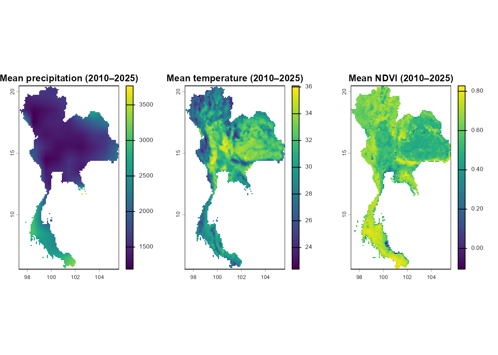

``` r

par(mfrow = c(1, 1))     # reset the plot region back to a single panel
```

Reading the panels: each map is the per-pixel average of the
corresponding variable across the 16 modelled years, in the variable’s
natural units (mm for precipitation, °C-equivalent units for
land-surface-temperature-derived `temp`, and a unitless 0–1 index for
NDVI). Bright patches stand for places that were *consistently* wet,
warm, or vegetated; dark patches stand for places that were
*consistently* dry, cool, or sparse. This is the environmental landscape
`bean` will use to define the thinning grid.

### Environmental thinning with `bean`

We reduce **environmental sampling bias** in the Sambar deer occurrences
using `bean`, with the temporal-mean stack `env_ref` from the previous
section as the reference E-space. Because the reference E-space is a
single, period-wide summary (not year-specific), we run `bean` **once on
the full occurrence table** rather than year by year — every record is
judged against the same environmental landscape, so two records that
fall in the same pod are environmentally redundant regardless of which
year they were collected in.

We use the **`"sheather-jones"`** bandwidth selector inside
[`find_env_resolution()`](https://paanwaris.github.io/bean/reference/find_env_resolution.html).
Sheather–Jones is a data-adaptive, plug-in selector (Sheather & Jones,
1991) that is robust to the non-Gaussian shapes typical of real
occurrence data — it is the modern recommended default and is what the
workshop uses everywhere bean appears. We pair it with the stochastic
[`thin_env_nd()`](https://paanwaris.github.io/bean/reference/thin_env_nd.html)
so each pod retains one of the original GBIF coordinates rather than a
synthetic centroid.

Every column of the original `sambar` table is preserved on the output.
After thinning bean returns only the longitude/latitude pair, so we
recover the full original attributes (including the `year` column the
temporal modelling needs) by matching on the coordinate pair.

``` r

# Pass only the coordinate pair into bean; the full attribute table is
# recovered below by joining the thinned coordinates back onto `sambar`.
sambar_xy <- sambar[, c("longitude", "latitude")]

# Extract the three temporal-mean env values at every occurrence, and
# z-score them so all three axes share the same numeric scale.
prepped <- prepare_bean(
  data        = sambar_xy,
  env_rasters = env_ref,        # temporal-mean 3-layer stack
  longitude   = "longitude",
  latitude    = "latitude",
  transform   = "scale"
)

# Sheather-Jones plug-in bandwidth as the cell width (one width per
# variable, in z-score units because prepare_bean() scaled the data).
res <- find_env_resolution(
  data     = prepped,
  env_vars = c("mean_prec", "mean_temp", "mean_NDVI"),
  method   = "sheather-jones"
)

# Build the environmental grid using `res$suggested_resolution` and
# randomly retain one of the original occurrences in every occupied pod.
thin_out <- thin_env_nd(
  data            = prepped,
  env_vars        = c("mean_prec", "mean_temp", "mean_NDVI"),
  grid_resolution = res$suggested_resolution
)

# Recover every original column by matching on the coordinate pair.
keep_key <- paste(thin_out$thinned_data$longitude,
                  thin_out$thinned_data$latitude)
sambar_thinned <- sambar[
  paste(sambar$longitude, sambar$latitude) %in% keep_key, , drop = FALSE
]

# Before / after counts per year — verifies that the year column survived.
data.frame(
  year   = sort(unique(sambar$year)),
  before = as.integer(table(sambar$year)),
  after  = as.integer(table(factor(sambar_thinned$year,
                                   levels = sort(unique(sambar$year)))))
)
```

    ##    year before after
    ## 1  2010      7     0
    ## 2  2011     23     4
    ## 3  2012     22     4
    ## 4  2013     27     5
    ## 5  2014     29     2
    ## 6  2015     31     3
    ## 7  2016     30     4
    ## 8  2017     31    10
    ## 9  2018     40     4
    ## 10 2019     55     3
    ## 11 2020     19     4
    ## 12 2021     17     2
    ## 13 2022     68    11
    ## 14 2023    106    18
    ## 15 2024    143    18
    ## 16 2025    226    28

``` r

# Use the thinned table for everything that follows.
sambar <- sambar_thinned
```

Every pod of the temporal-mean E-space now contributes at most one
Sambar deer occurrence, so the modelling table no longer over-represents
the heavily-surveyed parts of the environment.

### Spatio-temporal rarefaction

Once the per-year thinning has reduced *environmental* duplication, we
still want to reduce *spatial* duplication: keep at most one record per
raster pixel **per year**, so a repeated visit to the same place in a
later year is preserved as a temporally-independent observation.

``` r

# Working directory for everything point-related downstream.
points_dir <- "data/processed/points"
dir.create(points_dir, showWarnings = FALSE, recursive = TRUE)

# Persist the thinned table to disk so spatiotemporal_rarefaction() can
# pick it up by file path.
points_csv <- file.path(points_dir, "sambar_temporal.csv")
write_csv(sambar, points_csv)

# Use the CRS of the reference raster so points and rasters live in the
# same coordinate system throughout the pipeline.
study_crs <- st_crs(rast(ref_raster))

rare_out <- spatiotemporal_rarefaction(
  points_sp        = points_csv, # input CSV of presences
  output_dir       = file.path(points_dir, "rarefied"), # where rarefied tables are written
  reference_raster = ref_raster, # defines the pixel grid for rarefaction
  time_cols        = "year", # column carrying the time stamp
  xcol             = "longitude", # column with x coordinate
  ycol             = "latitude", # column with y coordinate
  points_crs       = study_crs, # CRS of the input points
  output_prefix    = "Sambar_annual" # prefix for the written files
)

# The three counts below show how aggressive rarefaction was: how many
# records went in, how many survive pure spatial rarefaction, and how
# many survive spatio-temporal rarefaction (one record per pixel per
# year).
rare_out$input_points # n records that entered rarefaction
```

    ## [1] 120

``` r

rare_out$spatial_points # n surviving pure spatial rarefaction (one per pixel)
```

    ## [1] 119

``` r

rare_out$spatiotemporal_points # n surviving spatio-temporal (one per pixel per year)
```

    ## [1] 119

### Match each observation to the environment it experienced

[`temporally_explicit_extraction()`](https://cjhughes926.github.io/TemporalModelR/reference/temporally_explicit_extraction.html)
walks the aligned raster directory using `variable_patterns`: clean
variable names on the left, filename patterns with time placeholders
(`YEAR`) on the right. For each surviving occurrence, it pulls the
precipitation, temperature, and NDVI values from the raster of the
matching year — so a 2014 record is paired with the 2014 climate, not
the long-term average.

``` r

# Output directory for the extracted tables and the scaling parameters.
ext_dir <- file.path(points_dir, "extracted")

ext_out <- temporally_explicit_extraction(
  points_sp           = rare_out$files_created$spatiotemporal, # rarefied points to extract at
  raster_dir          = aligned_dir,                           # raster source folder
  variable_patterns   = c(                                     # variable -> filename pattern map
    "prec" = "prec_YEAR",
    "temp" = "temp_YEAR",
    "NDVI" = "NDVI_YEAR"
  ),
  time_cols           = "year",                # time-stamp column on the points
  xcol                = "X",                   # rarefied table uses upper-case X / Y
  ycol                = "Y",
  points_crs          = study_crs,             # CRS shared by points and rasters
  output_dir          = ext_dir,
  output_prefix       = "sambar_extracted",
  save_raw            = TRUE,                  # write the raw (un-scaled) extracted table
  save_scaled         = TRUE,                  # also write a z-scored copy
  save_scaling_params = TRUE                   # write the per-variable means + SDs we'll reuse
)

# Inspect the first few rows of the raw (un-scaled) extracted table.
head(ext_out$raw_values)
```

    ##   year pixel_id     prec     temp      NDVI         x        y
    ## 1 2025     1698 1636.465 22.73027 0.7164522  99.38985 18.82608
    ## 2 2022     1785 1563.137 28.29210 0.7183695  98.82302 18.68756
    ## 3 2021     3210 1561.478 25.62316 0.7308000 101.57942 17.36530
    ## 4 2025     3574 1649.073 27.18566 0.6480218 100.87285 16.99498
    ## 5 2023     3676 1159.333 28.01327 0.6358696 101.66922 16.89389
    ## 6 2025     3677 1590.410 24.14503 0.6517609 101.69314 16.96520

``` r

# The means and SDs used to z-score the points. We will re-use these
# below so the rasters and points share the same transformation.
ext_out$scaling_params
```

    ##   variable         mean          sd
    ## 1     prec 1610.9887521 450.0060632
    ## 2     temp   27.9146341   2.6870713
    ## 3     NDVI    0.6761184   0.1016402

### Scale rasters

[`scale_rasters()`](https://cjhughes926.github.io/TemporalModelR/reference/scale_rasters.html)
z-scores every raster in `input_dir` using the per-variable means and
SDs from extraction, so that the rasters and the occurrence points share
the *same* transformation. This is critical: a GLM or RF coefficient
learned on z-scored points only makes sense when applied to z-scored
rasters.

``` r

# Destination directory for the scaled (z-scored) per-year rasters.
scaled_dir <- "data/processed/rasters_scaled"
dir.create(scaled_dir, showWarnings = FALSE, recursive = TRUE)

scale_rasters(
  input_dir           = aligned_dir,                              # raw aligned rasters
  output_dir          = scaled_dir,                               # write the z-scored copies here
  scaling_params_file = ext_out$files_created$scaling_params,     # reuse the means + SDs from extraction
  variable_patterns   = c(
    "prec" = "prec_YEAR",
    "temp" = "temp_YEAR",
    "NDVI" = "NDVI_YEAR"
  ),
  time_cols = "year",
  overwrite = TRUE       # replace any scaled files left from a previous run
)
```

### Spatiotemporal partitioning

[`spatiotemporal_partition()`](https://cjhughes926.github.io/TemporalModelR/reference/spatiotemporal_partition.html)
splits the occurrence + raster history into cross-validation folds in
**both** space and time, so a fold left out for testing is novel along
both dimensions — a much harder, more honest evaluation than random
k-fold CV.

``` r

par(mfrow = c(1, 3))

partition <- spatiotemporal_partition(
  reference_shapefile_path = thailand,                       # study-area polygon (Thailand)
  points_file_path         = ext_out$files_created$scaled,   # presence table with extracted env
  xcol                     = "x",                            # scaled table uses lower-case x / y
  ycol                     = "y",
  points_crs               = study_crs,
  time_cols                = "year",
  n_spatial_folds          = 2,         # how many blocks to split the country into
  n_temporal_folds         = 2,         # how many blocks to split the years into
  max_imbalance            = 0.15,      # max allowed presence imbalance between folds
  create_plot              = TRUE       # produce the fold-map diagnostic
)
```

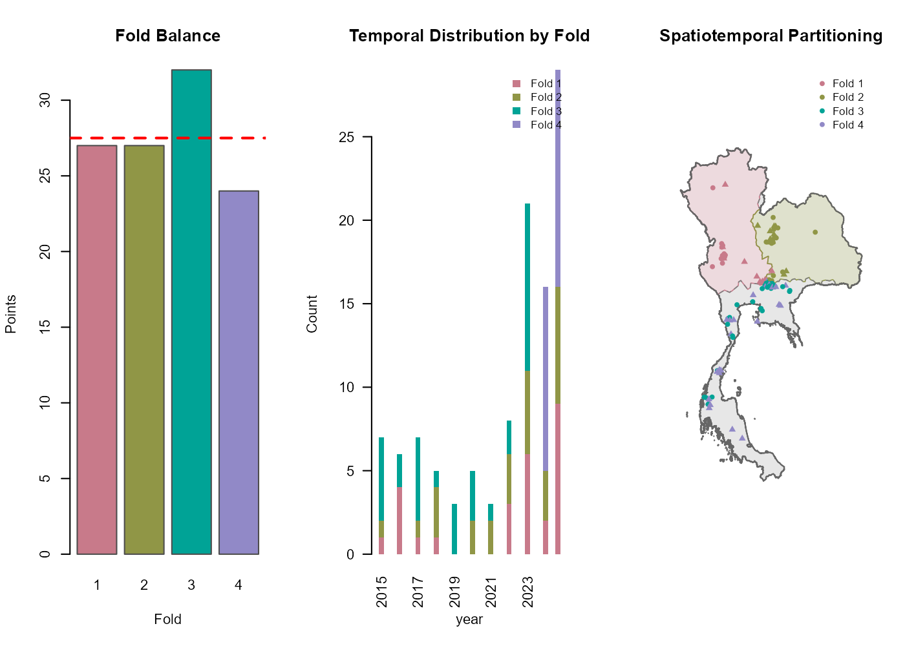

``` r

# Summary table: which fold has which years and which spatial block.
partition$summary
```

    ##                        parameter          value
    ## 1                    total_folds              4
    ## 2                n_spatial_folds              2
    ## 3               n_temporal_folds              2
    ## 4               n_balanced_folds              0
    ## 5                 n_random_folds              0
    ## 6                 partition_mode spatiotemporal
    ## 7                   total_points            119
    ## 8                 points_removed              0
    ## 9               pct_rows_removed              0
    ## 10           final_imbalance_pct          14.29
    ## 11 temporal_partitioning_enabled           TRUE

``` r

par(mfrow = c(1, 1))     # reset the plot region back to a single panel
```

### Generate pseudoabsences

A binary GLM or RF needs *absences* as well as presences. We generate
**fold-stratified pseudoabsences** — random non-presence locations drawn
at a 2:1 absence:presence ratio from anywhere outside a 50 km buffer
around the presences in the same fold.

``` r

absences <- generate_absences(
  partition_result         = partition,        # fold structure built above
  reference_shapefile_path = thailand,         # absences are drawn inside this polygon
  raster_dir               = scaled_dir,       # env values are extracted at each absence
  variable_patterns        = c(
    "prec" = "prec_YEAR",
    "temp" = "temp_YEAR",
    "NDVI" = "NDVI_YEAR"
  ),
  method                   = "buffer",         # draw absences outside a buffer around presences
  buffer_distance          = 50000,            # 50 km buffer around each presence
  ratio                    = 2,                # 2 absences per presence
  time_cols                = "year",
  create_plot              = TRUE,             # produce a diagnostic absence map
  plot_by_fold             = TRUE,             # one panel per fold
  verbose                  = FALSE             # silence per-fold progress messages
)
```

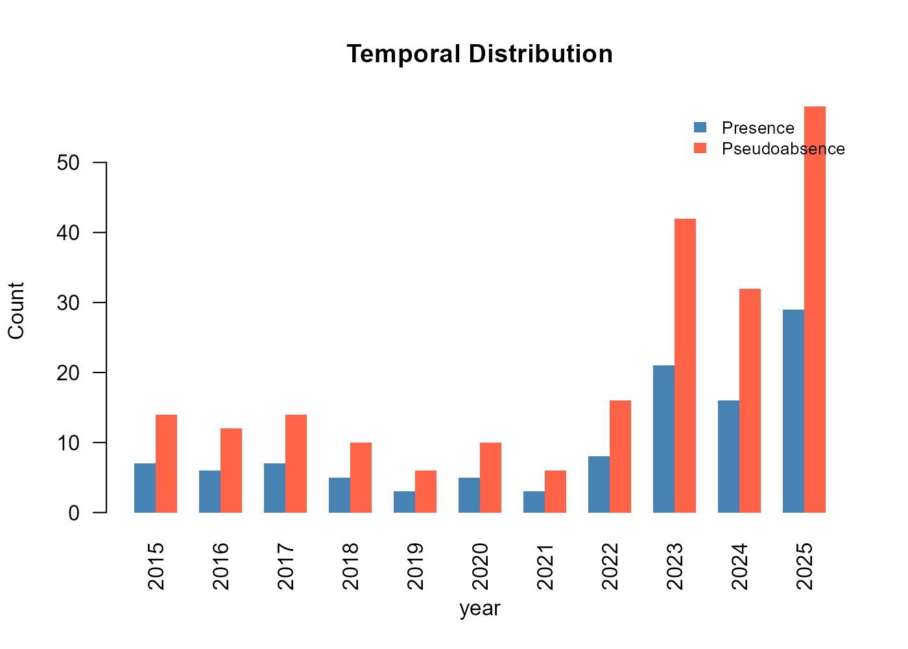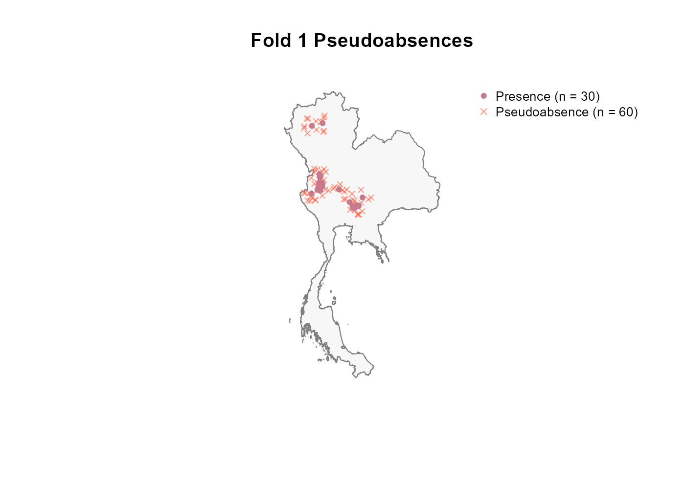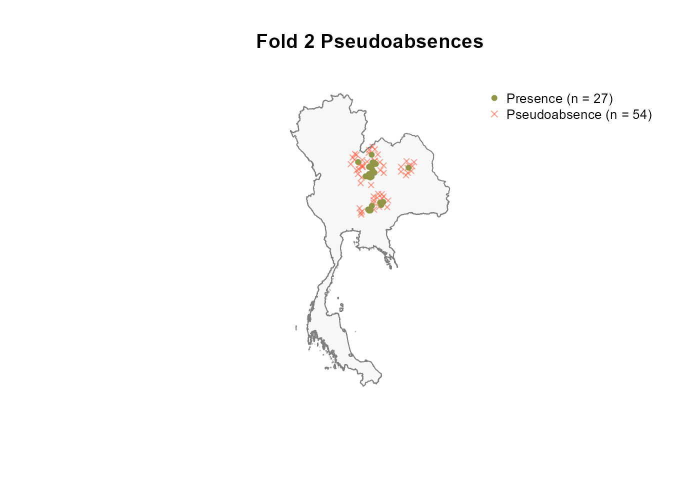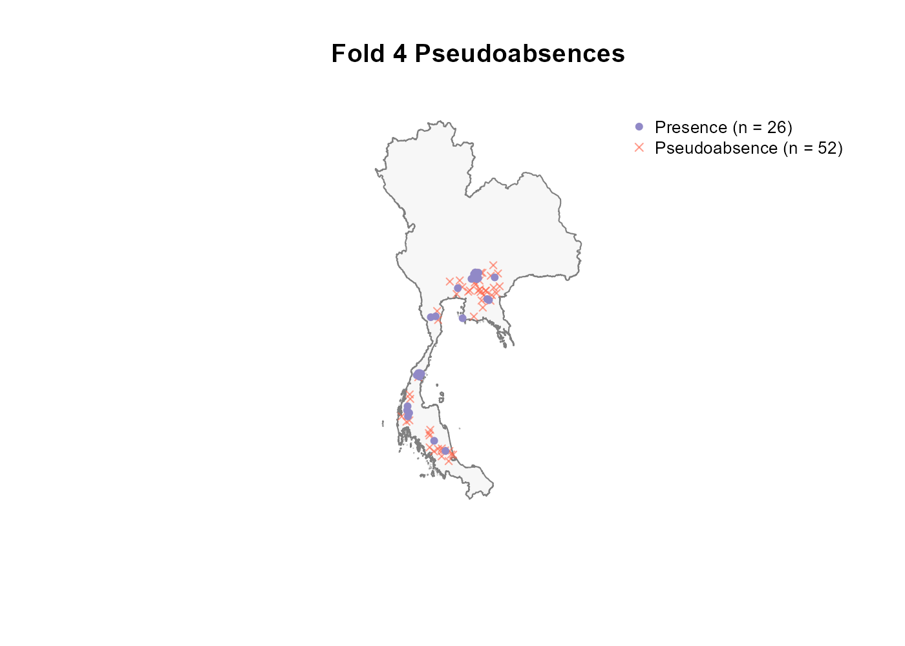

``` r

# Per-fold counts of presences vs absences.
absences$summary
```

    ##   fold n_presences n_pseudoabsences ratio_achieved
    ## 1    1          30               60              2
    ## 2    2          29               58              2
    ## 3    3          34               68              2
    ## 4    4          26               52              2

## Modelling

### GLM (with a quadratic term on temperature)

The temperature niche is expected to peak at some intermediate value and
fall away on either side, so we add a quadratic term on `temp` to
capture that hump. The `tss` threshold method picks the cutoff that
maximises the True Skill Statistic on each fold’s test set.

``` r

glm_res <- build_temporal_glm(
  partition_result     = partition,                        # CV folds in space + time
  pseudoabsence_result = absences,                         # presences + absences per fold
  model_formula        = ~ temp + I(temp^2) + prec + NDVI, # quadratic on temp, linear on prec / NDVI
  link                 = "logit",                          # binary GLM with logit link
  threshold_method     = "tss",                            # pick threshold maximising True Skill Statistic
  output_dir           = "outputs/GLM_Models",
  create_plot          = FALSE,
  overwrite            = TRUE,
  time_cols            = "year",
  verbose              = FALSE
)

# Out-of-fold test metrics — one row per fold.
glm_res$fold_test_metrics
```

    ##   Fold Threshold Testing_TP Testing_FN Testing_TN Testing_FP Sensitivity
    ## 1    1      0.30         20         10         31         29      0.6667
    ## 2    2      0.38         17         12         40         18      0.5862
    ## 3    3      0.27         25          9         40         28      0.7353
    ## 4    4      0.35         17          9         32         20      0.6538
    ##   Specificity    TSS  Kappa    AUC
    ## 1      0.5167 0.1833 0.1583 0.5694
    ## 2      0.6897 0.2759 0.2623 0.7271
    ## 3      0.5882 0.3235 0.2839 0.7379
    ## 4      0.6154 0.2692 0.2435 0.7041

### Random forest

The same setup but with a 500-tree random forest instead of a GLM. RFs
capture non-linear interactions automatically and usually outperform the
GLM at the cost of a less interpretable model.

``` r

rf_res <- build_temporal_rf(
  partition_result     = partition,                  # CV folds in space + time
  pseudoabsence_result = absences,                   # presences + absences per fold
  model_vars           = c("temp", "prec", "NDVI"),  # predictors (RF needs no formula)
  rf_params            = list(ntree = 500),          # 500-tree forest
  threshold_method     = "tss",                      # pick threshold maximising True Skill Statistic
  output_dir           = "outputs/RF_Models",
  create_plot          = FALSE,
  overwrite            = TRUE,
  time_cols            = "year"
)

rf_res$fold_test_metrics
```

    ##   Fold Threshold Testing_TP Testing_FN Testing_TN Testing_FP Sensitivity
    ## 1    1      0.35         13         17         42         18      0.4333
    ## 2    2      0.34         13         16         43         15      0.4483
    ## 3    3      0.35         19         15         47         21      0.5588
    ## 4    4      0.33         17          9         32         20      0.6538
    ##   Specificity    TSS  Kappa    AUC
    ## 1      0.7000 0.1333 0.1322 0.5900
    ## 2      0.7414 0.1897 0.1913 0.6231
    ## 3      0.6912 0.2500 0.2394 0.6730
    ## 4      0.6154 0.2692 0.2435 0.6435

## Project predictions through time

[`generate_spatiotemporal_predictions()`](https://cjhughes926.github.io/TemporalModelR/reference/generate_spatiotemporal_predictions.html)
walks every time step, loads the matching rasters, applies the fitted
model, and writes one prediction raster per fold × year combination. We
run it once for the GLM and once for the random forest.

``` r

time_steps <- data.frame(year = 2010:2025)

glm_preds <- generate_spatiotemporal_predictions(
  partition_result     = partition,                  # fold geometry to apply
  model_result         = glm_res,                    # fitted GLM models (one per fold)
  pseudoabsence_result = absences,                   # used to project on each fold's domain
  raster_dir           = scaled_dir,                 # z-scored per-year predictor rasters
  variable_patterns    = c("prec" = "prec_YEAR",
                           "temp" = "temp_YEAR",
                           "NDVI" = "NDVI_YEAR"),
  time_cols            = "year",
  time_steps           = time_steps,                 # years to project (data frame above)
  output_dir           = "outputs/glm_predictions",
  overwrite            = TRUE
)

rf_preds <- generate_spatiotemporal_predictions(
  partition_result     = partition,
  model_result         = rf_res,                     # fitted RF models (one per fold)
  pseudoabsence_result = absences,
  raster_dir           = scaled_dir,
  variable_patterns    = c("prec" = "prec_YEAR",
                           "temp" = "temp_YEAR",
                           "NDVI" = "NDVI_YEAR"),
  time_cols            = "year",
  time_steps           = time_steps,
  output_dir           = "outputs/rf_predictions",
  overwrite            = TRUE
)
```

Quick look at four representative years for the RF model:

``` r

# Pick a few representative years inside the modelled range (2010-2025).
sample_years <- c(2010, 2015, 2020, 2025)

rf_files <- list.files(
  "outputs/rf_predictions",
  pattern    = paste0("Prediction_.*(",
                      paste(sample_years, collapse = "|"),
                      ").*\\.tif$"),
  full.names = TRUE
)

# Stack at most as many prediction rasters as we have sample_years.
rf_stack <- terra::rast(rf_files[seq_len(min(length(sample_years),
                                             length(rf_files)))])

par(mfrow = c(1, terra::nlyr(rf_stack)))
for (i in seq_len(terra::nlyr(rf_stack))) {
  plot(rf_stack[[i]],
       main = names(rf_stack)[i])
  plot(sf::st_geometry(thailand), add = TRUE, border = "grey20")
}
```

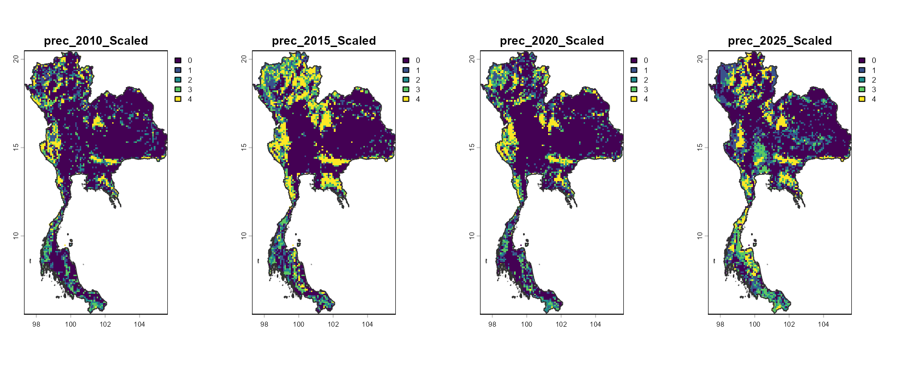

``` r

par(mfrow = c(1, 1))
```

Reading the panels: each map is the modelled suitability surface for one
year (yellow = high suitability, dark = low). Panels are arranged left
to right in chronological order, so any *shift* in the bright patches
across panels is the model’s view of how Sambar deer habitat changed
during 2010–2025.

## Postprocessing

### Consensus surfaces across folds

[`summarize_raster_outputs()`](https://cjhughes926.github.io/TemporalModelR/reference/summarize_raster_outputs.html)
reads the per-time-step prediction rasters from the prediction directory
and applies a consensus rule across folds to flag pixels that *most*
folds agree are suitable.

``` r

consensus <- summarize_raster_outputs(
  predictions_dir = "outputs/rf_predictions",   # folder of per-fold per-year predictions
  output_dir      = "outputs/rf_consensus",     # folder where the consensus rasters go
  overwrite       = TRUE
)

plot(consensus$frequency_raster,
     main = "Proportion of time steps each pixel was suitable (RF)")
```

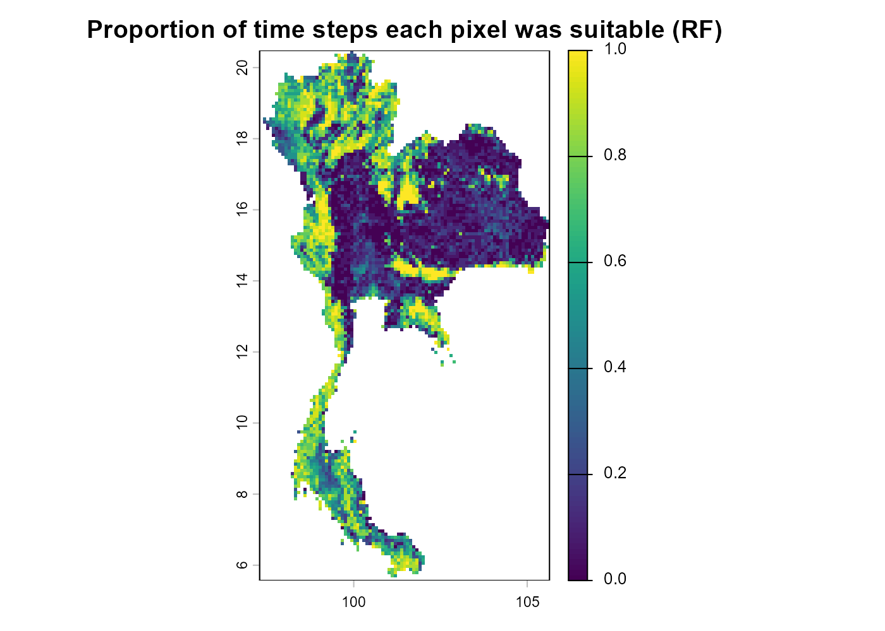

The frequency raster runs from 0 (never suitable) to 1 (suitable in
every year). Patches in the dark-yellow / cream range mark pixels that
the RF model labels suitable in every single year — the persistent core
of the niche.

### Pixel-level temporal trajectories (changepoint analysis)

[`analyze_temporal_patterns()`](https://cjhughes926.github.io/TemporalModelR/reference/analyze_temporal_patterns.html)
runs `fastcpd` per pixel and classifies each pixel’s trajectory across
years into one of six categories: never-suitable, always-suitable,
no-pattern (statistically flat), increasing, decreasing, or fluctuating.
The result is a categorical map of *how* habitat is changing rather than
just *whether* it is suitable.

``` r

patterns_out <- analyze_temporal_patterns(
  binary_stack            = consensus$consensus_stack,   # one binary layer per time step
  summary_raster          = consensus$frequency_raster,  # the 0-1 frequency surface from above
  time_steps              = time_steps,
  output_dir              = "outputs/rf_patterns",
  spatial_autocorrelation = FALSE,                       # skip the spatial autocorrelation correction
  estimate_time           = FALSE,                       # skip the runtime estimator
  overwrite               = TRUE
)
```

    ##   |                                                          |                                                  |   0%  |                                                          |                                                  |   1%  |                                                          |=                                                 |   1%  |                                                          |=                                                 |   2%  |                                                          |=                                                 |   3%  |                                                          |==                                                |   3%  |                                                          |==                                                |   4%  |                                                          |==                                                |   5%  |                                                          |===                                               |   5%  |                                                          |===                                               |   6%  |                                                          |===                                               |   7%  |                                                          |====                                              |   7%  |                                                          |====                                              |   8%  |                                                          |====                                              |   9%  |                                                          |=====                                             |   9%  |                                                          |=====                                             |  10%  |                                                          |=====                                             |  11%  |                                                          |======                                            |  11%  |                                                          |======                                            |  12%  |                                                          |======                                            |  13%  |                                                          |=======                                           |  13%  |                                                          |=======                                           |  14%  |                                                          |=======                                           |  15%  |                                                          |========                                          |  15%  |                                                          |========                                          |  16%  |                                                          |========                                          |  17%  |                                                          |=========                                         |  17%  |                                                          |=========                                         |  18%  |                                                          |=========                                         |  19%  |                                                          |==========                                        |  19%  |                                                          |==========                                        |  20%  |                                                          |==========                                        |  21%  |                                                          |===========                                       |  21%  |                                                          |===========                                       |  22%  |                                                          |===========                                       |  23%  |                                                          |============                                      |  23%  |                                                          |============                                      |  24%  |                                                          |============                                      |  25%  |                                                          |=============                                     |  25%  |                                                          |=============                                     |  26%  |                                                          |=============                                     |  27%  |                                                          |==============                                    |  27%  |                                                          |==============                                    |  28%  |                                                          |==============                                    |  29%  |                                                          |===============                                   |  29%  |                                                          |===============                                   |  30%  |                                                          |===============                                   |  31%  |                                                          |================                                  |  31%  |                                                          |================                                  |  32%  |                                                          |================                                  |  33%  |                                                          |=================                                 |  33%  |                                                          |=================                                 |  34%  |                                                          |=================                                 |  35%  |                                                          |==================                                |  35%  |                                                          |==================                                |  36%  |                                                          |==================                                |  37%  |                                                          |===================                               |  37%  |                                                          |===================                               |  38%  |                                                          |===================                               |  39%  |                                                          |====================                              |  39%  |                                                          |====================                              |  40%  |                                                          |====================                              |  41%  |                                                          |=====================                             |  41%  |                                                          |=====================                             |  42%  |                                                          |=====================                             |  43%  |                                                          |======================                            |  43%  |                                                          |======================                            |  44%  |                                                          |======================                            |  45%  |                                                          |=======================                           |  45%  |                                                          |=======================                           |  46%  |                                                          |=======================                           |  47%  |                                                          |========================                          |  47%  |                                                          |========================                          |  48%  |                                                          |========================                          |  49%  |                                                          |=========================                         |  49%  |                                                          |=========================                         |  50%  |                                                          |=========================                         |  51%  |                                                          |==========================                        |  51%  |                                                          |==========================                        |  52%  |                                                          |==========================                        |  53%  |                                                          |===========================                       |  53%  |                                                          |===========================                       |  54%  |                                                          |===========================                       |  55%  |                                                          |============================                      |  55%  |                                                          |============================                      |  56%  |                                                          |============================                      |  57%  |                                                          |=============================                     |  57%  |                                                          |=============================                     |  58%  |                                                          |=============================                     |  59%  |                                                          |==============================                    |  59%  |                                                          |==============================                    |  60%  |                                                          |==============================                    |  61%  |                                                          |===============================                   |  61%  |                                                          |===============================                   |  62%  |                                                          |===============================                   |  63%  |                                                          |================================                  |  63%  |                                                          |================================                  |  64%  |                                                          |================================                  |  65%  |                                                          |=================================                 |  65%  |                                                          |=================================                 |  66%  |                                                          |=================================                 |  67%  |                                                          |==================================                |  67%  |                                                          |==================================                |  68%  |                                                          |==================================                |  69%  |                                                          |===================================               |  69%  |                                                          |===================================               |  70%  |                                                          |===================================               |  71%  |                                                          |====================================              |  71%  |                                                          |====================================              |  72%  |                                                          |====================================              |  73%  |                                                          |=====================================             |  73%  |                                                          |=====================================             |  74%  |                                                          |=====================================             |  75%  |                                                          |======================================            |  75%  |                                                          |======================================            |  76%  |                                                          |======================================            |  77%  |                                                          |=======================================           |  77%  |                                                          |=======================================           |  78%  |                                                          |=======================================           |  79%  |                                                          |========================================          |  79%  |                                                          |========================================          |  80%  |                                                          |========================================          |  81%  |                                                          |=========================================         |  81%  |                                                          |=========================================         |  82%  |                                                          |=========================================         |  83%  |                                                          |==========================================        |  83%  |                                                          |==========================================        |  84%  |                                                          |==========================================        |  85%  |                                                          |===========================================       |  85%  |                                                          |===========================================       |  86%  |                                                          |===========================================       |  87%  |                                                          |============================================      |  87%  |                                                          |============================================      |  88%  |                                                          |============================================      |  89%  |                                                          |=============================================     |  89%  |                                                          |=============================================     |  90%  |                                                          |=============================================     |  91%  |                                                          |==============================================    |  91%  |                                                          |==============================================    |  92%  |                                                          |==============================================    |  93%  |                                                          |===============================================   |  93%  |                                                          |===============================================   |  94%  |                                                          |===============================================   |  95%  |                                                          |================================================  |  95%  |                                                          |================================================  |  96%  |                                                          |================================================  |  97%  |                                                          |================================================= |  97%  |                                                          |================================================= |  98%  |                                                          |================================================= |  99%  |                                                          |==================================================|  99%  |                                                          |==================================================| 100%

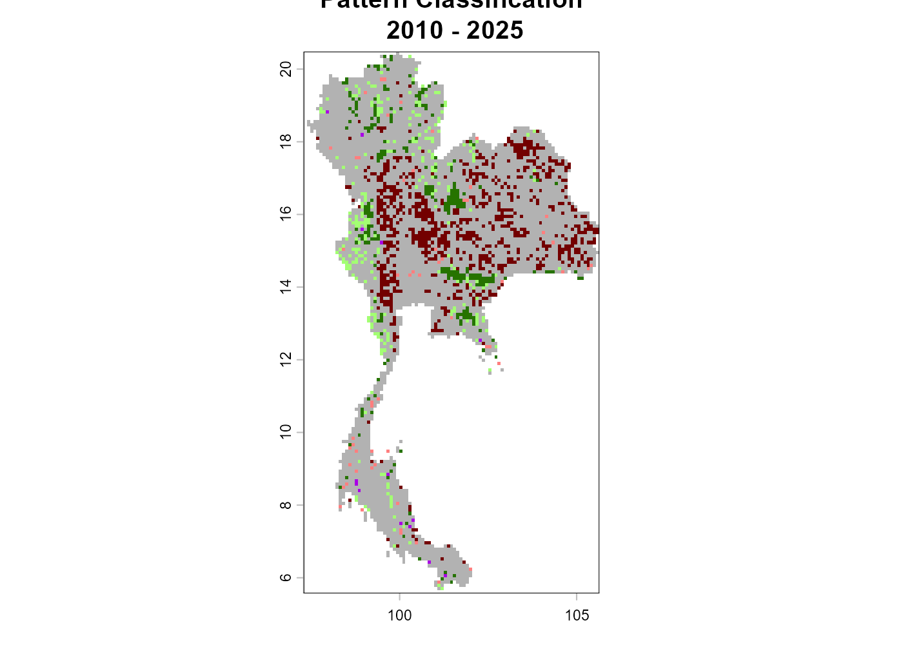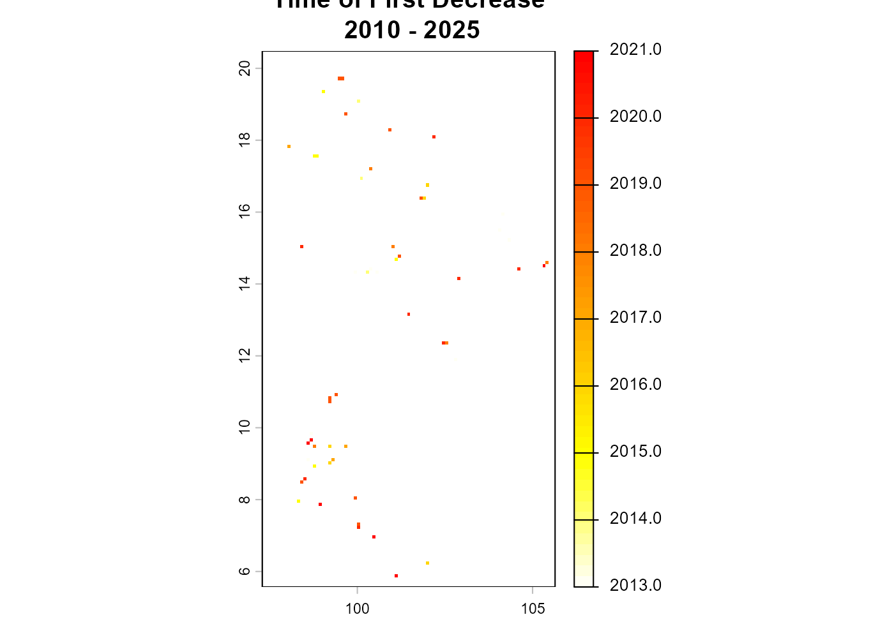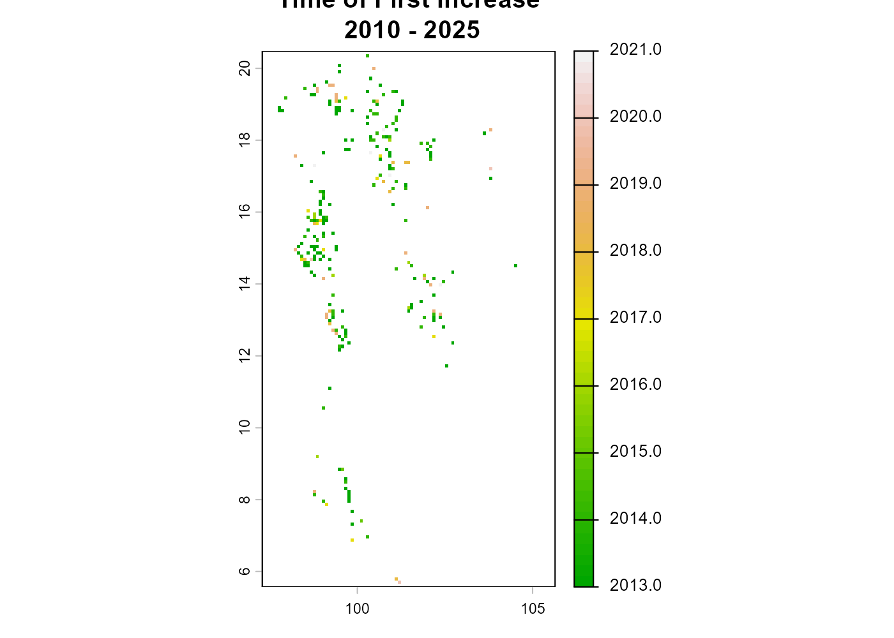

``` r

plot(patterns_out$pattern,
     main = "Temporal trajectory class per pixel",
     type = "classes")
```

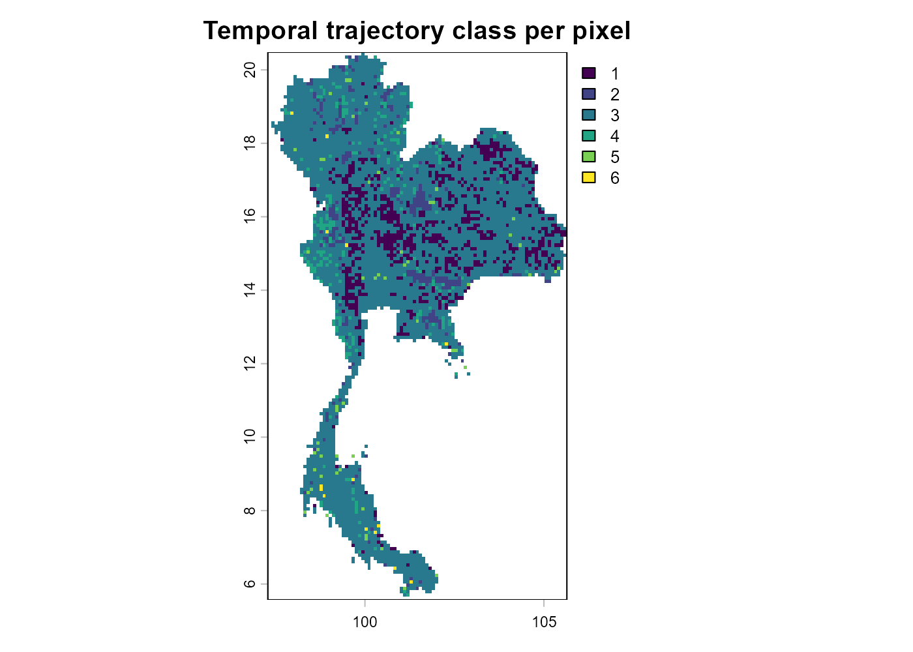

### Aggregate by spatial unit (Thailand provinces)

Pixel-level maps are powerful but hard to summarise verbally.
[`analyze_trends_by_spatial_unit()`](https://cjhughes926.github.io/TemporalModelR/reference/analyze_trends_by_spatial_unit.html)
aggregates the pixel trajectories to a province polygon set (here, GADM
level 1 — Thailand’s provinces) so we can talk about results region by
region.

``` r

# Download Thailand provinces (GADM level 1) and convert SpatVector -> sf
# so analyze_trends_by_spatial_unit() can read it.
provinces <- geodata::gadm(country = "THA", level = 1, path = "data/raw") |>
  st_as_sf()

regional <- analyze_trends_by_spatial_unit(
  shapefile_path       = provinces,                       # the polygons to aggregate by
  name_field           = "NAME_1",                        # province-name column
  binary_stack         = consensus$consensus_stack,       # per-time-step binary suitability
  pattern_raster       = patterns_out$pattern,            # trajectory class per pixel
  time_decrease_raster = patterns_out$time_decrease,      # estimated time-of-decrease per pixel
  time_increase_raster = patterns_out$time_increase,      # estimated time-of-increase per pixel
  time_steps           = time_steps,
  output_dir           = "outputs/rf_regional",
  overwrite            = TRUE,
  create_plot          = TRUE                             # produce the three diagnostic plots below
)
```

    ##   |                                                          |                                                  |   0%  |                                                          |===                                               |   6%  |                                                          |======                                            |  12%  |                                                          |=========                                         |  19%  |                                                          |============                                      |  25%  |                                                          |================                                  |  31%  |                                                          |===================                               |  38%  |                                                          |======================                            |  44%  |                                                          |=========================                         |  50%  |                                                          |============================                      |  56%  |                                                          |===============================                   |  62%  |                                                          |==================================                |  69%  |                                                          |======================================            |  75%  |                                                          |=========================================         |  81%  |                                                          |============================================      |  88%  |                                                          |===============================================   |  94%  |                                                          |==================================================| 100%

    ##   |                                                          |                                                  |   0%  |                                                          |===                                               |   6%  |                                                          |======                                            |  12%  |                                                          |=========                                         |  19%  |                                                          |============                                      |  25%  |                                                          |================                                  |  31%  |                                                          |===================                               |  38%  |                                                          |======================                            |  44%  |                                                          |=========================                         |  50%  |                                                          |============================                      |  56%  |                                                          |===============================                   |  62%  |                                                          |==================================                |  69%  |                                                          |======================================            |  75%  |                                                          |=========================================         |  81%  |                                                          |============================================      |  88%  |                                                          |===============================================   |  94%  |                                                          |==================================================| 100%

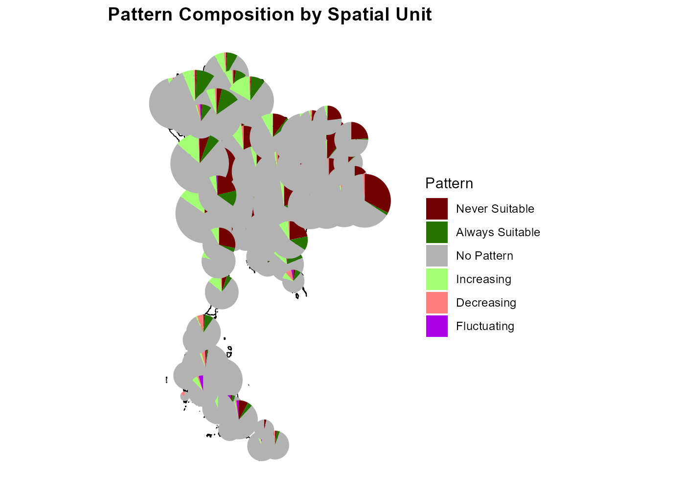

``` r

head(regional$overall_summary)
```

    ##         Spatial_Unit Always_Absent Always_Present No_Pattern Increasing
    ## 1      Amnat Charoen             8              0         44          0
    ## 2          Ang Thong             0              0         16          0
    ## 3 Bangkok Metropolis             2              0         30          0
    ## 4          Bueng Kan            13              0         41          2
    ## 5           Buri Ram            29              8        102          1
    ## 6       Chachoengsao             6              8         62          3
    ##   Decreasing Fluctuating Failed Total_Pixels Pct_Always_Absent
    ## 1          0           0      0           52             15.38
    ## 2          1           0      0           17              0.00
    ## 3          0           0      0           32              6.25
    ## 4          0           0      0           56             23.21
    ## 5          1           0      0          141             20.57
    ## 6          0           0      0           79              7.59
    ##   Pct_Always_Present Pct_No_Pattern Pct_Increasing Pct_Decreasing
    ## 1               0.00          84.62           0.00           0.00
    ## 2               0.00          94.12           0.00           5.88
    ## 3               0.00          93.75           0.00           0.00
    ## 4               0.00          73.21           3.57           0.00
    ## 5               5.67          72.34           0.71           0.71
    ## 6              10.13          78.48           3.80           0.00
    ##   Pct_Fluctuating Prop_Increasing Prop_Stable_Suitable Prop_Decreasing
    ## 1               0            0.00                 0.00            0.00
    ## 2               0            0.00                 0.00            5.88
    ## 3               0            0.00                 0.00            0.00
    ## 4               0            4.65                 0.00            0.00
    ## 5               0            0.89                 7.14            0.75
    ## 6               0            4.11                10.96            0.00
    ##   Prop_Stable_Unsuitable
    ## 1                  15.38
    ## 2                   0.00
    ## 3                   6.25
    ## 4                  23.21
    ## 5                  21.80
    ## 6                   8.45

``` r

# Diagnostic plots: a per-province time-series, an annual-change view,
# and a province-level total-change bar chart.
regional$plots$time_series
```

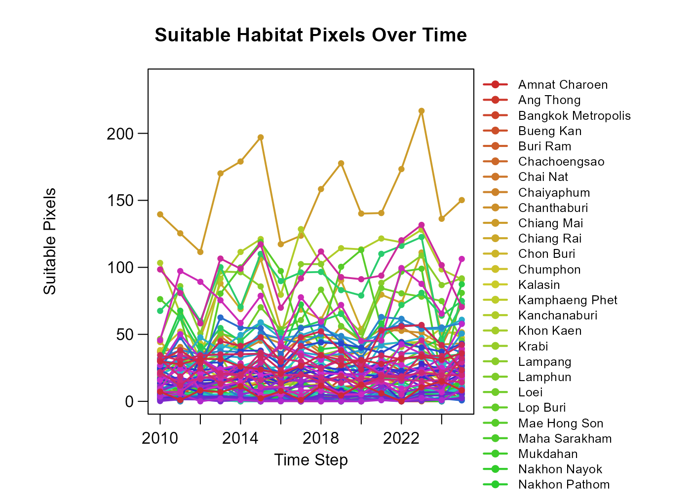

``` r

regional$plots$annual_change
```

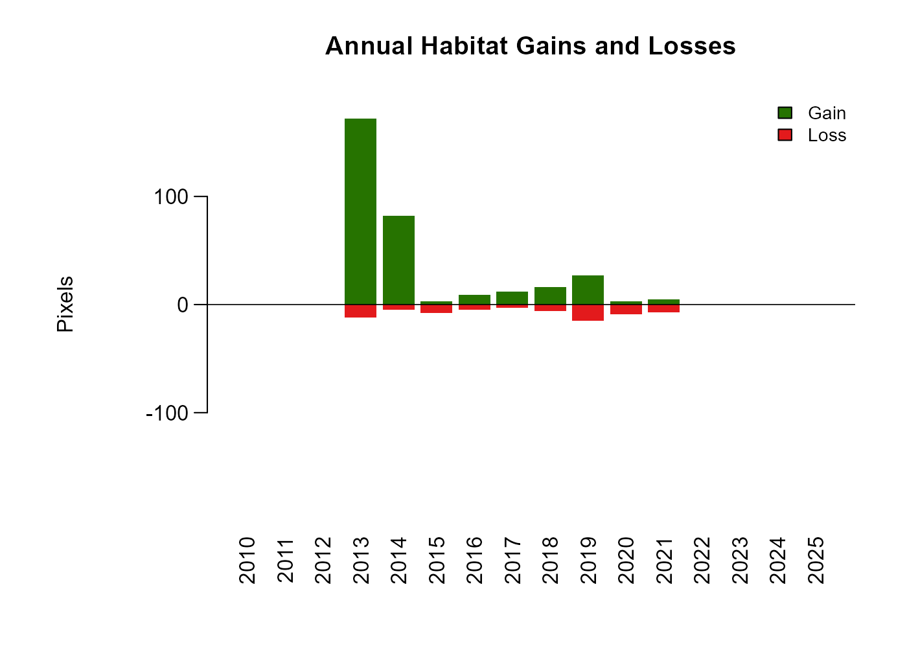

``` r

regional$plots$total_change_by_unit
```

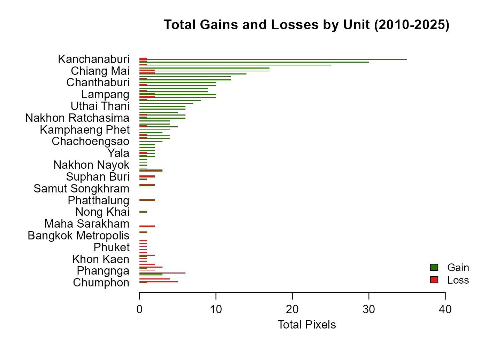

## Wrap-up

What we covered:

- Read the pre-prepared annual precipitation, temperature, and NDVI
  rasters directly from `data/processed/temporal_split/`.
- Summarised the per-year aligned rasters as a single **temporal-mean**
  3-layer stack (`mean_prec`, `mean_temp`, `mean_NDVI`) and used it as
  the reference E-space for thinning.
- Applied **`bean`** once against that temporal-mean E-space
  (Sheather–Jones bandwidth, stochastic per-pod thinning) to reduce
  environmental sampling bias across the full Sambar deer occurrence
  table before any temporal modelling.
- Built a fully temporally-explicit pipeline: time-stamped occurrences ↔︎
  time-stamped rasters via
  [`temporally_explicit_extraction()`](https://cjhughes926.github.io/TemporalModelR/reference/temporally_explicit_extraction.html).
- Used spatio-temporal cross-validation folds and fold-stratified
  pseudoabsences for an honest evaluation.
- Fitted GLM and RF temporal models and projected them across 2010–2025.
- Classified pixel-level temporal trajectories with changepoint analysis
  and aggregated the results by Thai province.

## References

- Castaneda-Guzman M, Hughes C, Paansri P, Cobos M (2026). *nicheR:
  Ellipsoid-Based Virtual Niches and Visualization*. R package version
  0.1.0, <https://github.com/castanedaM/nicheR>.
- Hijmans R (2026). *geodata: Access Geographic Data*. R package version
  0.6-10, <https://rspatial.github.io/geodata/>.
- Hughes C, Castaneda-Guzman M, E. Escobar L (2026). *TemporalModelR:
  Temporally Explicit Species Distribution Modelling in R*. R package
  version 0.2.0, <https://github.com/CJHughes926/TemporalModelR>.
